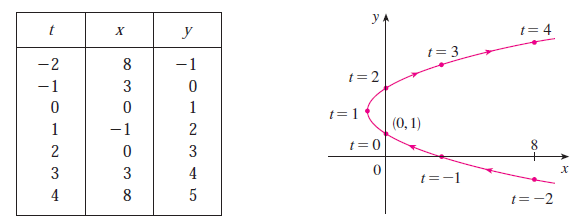
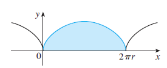



## I. Volume:

### 1. Definition of volume:

Let $S$ be a solid that lies between $x=a$ and $x=b$. If the cross-sectional area of $S$ in the plane $P_x$, through $x$ and perpendcular to the $x$-axis, is $A(x)$, where $A$ is a continous function, then the **volume** of $S$ is:

$$V=\displaystyle\lim_{n \to \infty} \sum_{i=1}^n A(x_i^*) \Delta x = \int_a^b A(x) dx$$

### 2. Method of cylindrical shell:

The volume, obtained by rotating about the $y$-axis the region under the curve $y=f(x)$ from $a$ to $b$, is:

$$V=\int_a^b 2\pi xf(x) dx \  \  \  \ \text{where $0 \leq a < b$}$$

## II. Arc length

The definition of the **length** $L$ of the curve $C$ with equation $y=f(x)$, $a \leq x \leq b$, is:

$$L=\lim_{n \to \infty} \sum_{i=1}^n \lvert P_{i-1}P_i\rvert$$

But it is not convenient for computational purposes, so we can derive the integral formula for $L$ in the case where $f$ has a continuous derivative.

$$
\lvert P_{i-1}P_i\rvert=\sqrt{(x_i-x_{i-1})^2+(y_i-y_{i-1})^2}
$$

Apply the Mean Value Theorem: $\displaystyle f'(x_i^*)=\frac{f(x_i)-f(x_{i-1})}{x_i-x_{i-1}}$

$$\begin{align*}
\lvert P_{i-1}P_i\rvert&=\sqrt{(x_i-x_{i-1})^2+\left[f'(x_i^*)(x_i-x_{i-1})\right]^2} \\
&=\sqrt{1+\left[f'(x_i^*)\right]^2} \ (x_i-x_{i-1}) 
= \sqrt{1+\left[f'(x_i^*)\right]^2} \ \Delta x
\end{align*}$$

So

$$
L=\lim_{n \to \infty} \sum_{i=1}^n \lvert P_{i-1}P_i\rvert=\lim_{n \to \infty} \sum_{i=1}^n \sqrt{1+\left[f'(x_i^*)\right]^2} \ \Delta x
$$

We can use the definition of definite integral, therefore:

$$
L=\int_a^b \sqrt{1+\left[f'(x)\right]^2} \ dx
$$

**_Example:_**

Find the exact length of the curve $(C): y=\dfrac{x^3}{3}+\dfrac{1}{4x}$, $1 \leq x \leq 2$

_Solution:_

We have: $\dfrac{dy}{dx}=x^2-\dfrac{1}{4x^2}$

Call $L$ be the desired length

$$\begin{align*}
L&=\int_1^2 \sqrt{1+\left(x^2-\frac{1}{4x^2}\right)^2} \ dx 
= \int_1^2 \sqrt{\frac{1}{2}+x^4+\frac{1}{16x^4}} \ dx \\
&= \int_1^2 \sqrt{\left(x^2+\frac{1}{4x^2}\right)^2} \ dx
=\int_1^2 \left(x^2+\frac{1}{4x^2}\right) \ dx \\
&=\left[\frac{x^3}{3}-\frac{1}{4x}\right]_1^2=\frac{59}{24}
\end{align*}$$

## III. Parametric Equations

### 1. Curves

Suppose that $x$ and $y$ are both given as functions of a third variable $t$ (called a **parameter**) by the equations

$$x=f(t) \ \ \ \ \ \ \ y=f(t)$$

(called **parametric equations**). Each value of $t$ determines a point $(x,y)$, which we can plot in a coordinate plane. As $t$ varies, the point $(x,y)=(f(t),g(t))$ varies and traces out a curve $C$, which we call a **parametric curve**.

_Example:_

$$x=t^2-2t \ \ \ \ \ \ \ \ y=t+1$$

### 2. Calculus with parametric curves

#### a. Tangents

Suppose $f$ and $g$ are differentiable functions and we want to fing the tangent line at a point on a curve where $y$ is also a differentiable function of $x$. Then the Chain Rule gives

$$ \frac{dy}{dt}=\frac{dy}{dx} \cdot \frac{dx}{dt}$$

If $dx/dt \neq 0$, then we can solve for $dy/dx$:
$$\frac{dy}{dx}=\cfrac{\cfrac{dy}{dt}}{\cfrac{dx}{dt}} \ \ \ \ \ \ \ \ \text{if} \ \ \frac{dx}{dt} \neq 0$$

Now we consider how to calculate $d^2y/dx^2$. This can be found by replacing $y$ by $dy/dx$ in equation above

$$\frac{d^2y}{dx^2}=\frac{d}{dx}\left(\frac{dy}{dx}\right)=\cfrac{\cfrac{d}{dt}\left(\cfrac{dy}{dt}\right)}{\cfrac{dx}{dt}}$$

**_Example:_**

A curve $C$ is defined by parametric equations $\displaystyle \begin{cases}x=t^2 \\ y=t^3-3t\end{cases}$

Find the points on $C$ where the tangent is horizontal.

_Solution:_

$\displaystyle \frac{dy}{dx}=\frac{dy/dt}{dx/dt}=\frac{3t^2-3}{2t}=\frac{3}{2}\left(t-\frac{1}{t}\right)$

The tangent is horizontal $\Leftrightarrow$ $dy/dx=0$

$$\Leftrightarrow \frac{3}{2}\left(t-\frac{1}{t}\right)=0 \Leftrightarrow t^2=1 \Leftrightarrow t=\pm 1$$

With $t=1$, the according point is $(1,-2)$

With $t=-1$, the according point is $(1,2)$

$\therefore$ The points $(1,2)$ and $(1,-2)$ on $C$ where the tangent is horizontal.

#### b. Areas

We can caluclate the area formula by using the Substitution Rule for Definite Integrals as follows:

$$A=\int_a^b y \ dx=\int_\alpha^\beta g(t)f'(t) \ dt$$

**_Example_**

Find the area under one arch of the cycloid

$$x=r(\theta - \sin \theta) \ \ \ \ \ \ y=r(1-\cos \theta)$$

_Solution:_

$$\begin{align*}
A&=\int_0^{2\pi} y \ dx 
= \int_0^{2\pi} r(1-\cos \theta)r(1-\cos \theta) \ d\theta \\
&= r^2 \int_0^{2\pi} (1-\cos \theta)^2 \ d\theta
= r^2 \int_0^{2\pi} (1-2\cos \theta + \cos^2\theta) \ d\theta \\
&= r^2 \int_0^{2\pi} \left(1-2\cos\theta+\frac{1+\cos 2\theta}{2} \right) \ d\theta \\
&= r^2 \int_0^{2\pi} \left(\frac{3}{2}-2\cos\theta+ \frac{1}{2} \cos 2\theta\right) \ d\theta \\
&= r^2 \left[ \frac{3}{2}\theta - 2\sin\theta + \frac{1}{4} \sin 2\theta\right]_0^{2\pi} = 3\pi r^2
\end{align*}$$

#### c. Arc length

If a curve $C$ is described by the parametric equations $x=f(t), y=g(t), \alpha \leq t \leq \beta$, where $f'$ and $g'$ are continuous on $[\alpha,\beta]$ and $C$ is traversed exactly once as $t$ increases from $\alpha$ to $\beta$, then length of $C$ is

$$L = \int_\alpha^\beta \sqrt{\left(\frac{dx}{dt}\right)^2 + \left(\frac{dy}{dt}\right)^2} \ dt$$

**_Example:_**

Find the length of one arch of the cycloid

$$x=r(\theta - \sin \theta) \ \ \ \ \ \ y=r(1-\cos \theta)$$

_Solution:_

$$\begin{align*}
L&=\int_0^{2\pi} \sqrt{\left(\frac{dx}{d\theta}\right)^2 + \left(\frac{dy}{d\theta}\right)^2} \ d\theta \\
&=\int_0^{2\pi} \sqrt{\left[r(1-\cos\theta)\right]^2 + \left(r\sin\theta\right)^2} \ d\theta \\ 
&=r \int_0^{2\pi} \sqrt{1-2\cos\theta+\cos^2\theta + \sin^2\theta} \ d\theta \\
&=r \int_0^{2\pi} \sqrt{2(1-\cos\theta)} \ d\theta \\
&=r \int_0^{2\pi} \sqrt{4\sin^2\frac{\theta}{2}} \ d\theta \\
&=2r \int_0^{2\pi} \sin\frac{\theta}{2} \ d\theta \\
&=2r \left[-2\cos\frac{\theta}{2}\right]_0^{2\pi} = 8r
\end{align*}$$

