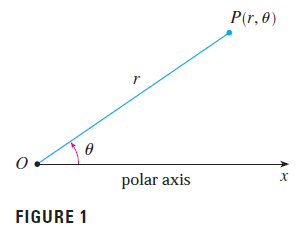
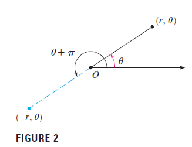
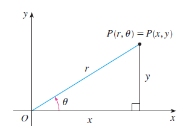
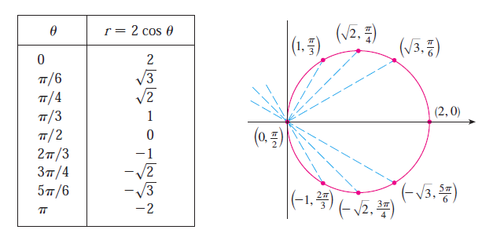
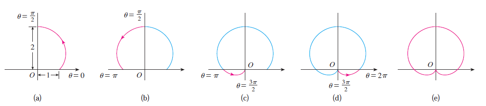



## I. Introduction to polar coordinate

We choose a point in the plane that is called the **pole** (or origin) and is labeled $O$. Then we draw a ray (half-line) starting at $O$ called the **polar axis**. This axis is usually drawn horizontally to the right and corresponds to the positive $x$-axis in Cartesian coordinates.

If is any other point in the plane, let $r$ be the distance from $O$ to $P$ and let $\theta$ be the angle $\theta$ (usually measured in radians) between the polar axis and the line $OP$ as in Figure 1. Then the point is represented by the ordered pair $(r,\theta)$ and $r$, $\theta$ are called polar coordinates of $P$. We use the convention that an angle is **positive** if measured in the **counterclockwise** direction from the polar axis and **negative** in the **clockwise** direction.

The connection between polar and Cartesian coordinate can be seen from below:

$$
x=r\cos\theta \ \ \ \ \ \ y=r\sin\theta \\
r^2=x^2+y^2 \ \ \ \ \ \ \theta=\arctan \dfrac{y}{x}
$$

## II. Polar curves

The **graph of a polar equation** $r=f(\theta)$, consists of all points $P$ that have at least one polar representation $(r,\theta)$ whose coordinates satisfy the equation.

**_Example:_** 

* Sketch the curve with polar equation $r=2 \cos\theta$

We can derive polar equation to $x,y$ equation as follows:

$$\begin{align*}
&r=2\cos\theta \\
\Leftrightarrow \ &r^2 = 2r\cos\theta \\
\Leftrightarrow \ &x^2+y^2 = 2x \\
\Leftrightarrow \ &(x-1)^2+y^2=1
\end{align*}$$

We can see that the above equation describing the circle exactly as in the graph.

* Sketch the curve $r=1+\sin\theta$

## III. Areas and lengths in polar coordinates

### 1. Area

The formula for the area $A$ of the polar region is:

$$
A=\int_a^b \frac{1}{2} [f(\theta)]^2 d\theta=\int_a^b \frac{1}{2} r^2 d\theta
$$

### 2. Arc length

The length $L$ of a curve with polar equation $r=f(\theta)$, $a \leq \theta \leq b$, is:

$$
L=\int_a^b \sqrt{r^2+\left(\frac{dr}{d\theta}\right)^2} \ d\theta
$$

We can obtain the above formula by using the fomula calculating the arc length of parametric curve and Product Rule:

$$
x=r\cos\theta \ \ \ \ \ \ y=r\sin\theta
$$

$$
\frac{dx}{d\theta}=\frac{dr}{d\theta}\cos\theta-r\sin\theta \ \ \ \ \ \ \ \ \frac{dy}{d\theta}=\frac{dr}{d\theta}\sin\theta+r\cos\theta
$$

So, using $$\sin^2\theta+\cos^2\theta=1$$, we have:

$$\begin{align*}
&\left(\frac{dx}{d\theta}\right)^2+\left(\frac{dy}{d\theta}\right)^2 \\
=&\left(\frac{dr}{d\theta}\cos\theta-r\sin\theta\right)^2+\left(\frac{dr}{d\theta}\sin\theta+r\cos\theta\right)^2 \\
=&\left(\frac{dr}{d\theta}\cos\theta\right)^2 + (r\sin\theta)^2 + \left(\frac{dr}{d\theta}\sin\theta\right)^2 + (r\cos\theta)^2 \\
=& \ r^2+\left(\frac{dr}{d\theta}\right)^2
\end{align*}$$

$$
\therefore L=\int_a^b \sqrt{\left(\frac{dx}{d\theta}\right)^2+\left(\frac{dy}{d\theta}\right)^2} \ d\theta=\int_a^b \sqrt{r^2+\left(\frac{dr}{d\theta}\right)^2} \ d\theta
$$

_Last update: 20:08 - 06/03/2023_
