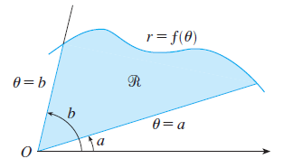
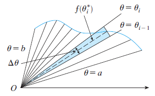



## I. Areas and lengths in polar coordinates

### 1. Area

The formula for the area $A$ of the polar region is:

$$
A=\int_a^b \frac{1}{2} [f(\theta)]^2 d\theta=\int_a^b \frac{1}{2} r^2 d\theta
$$

### 2. Arc length

The length $L$ of a curve with polar equation $r=f(\theta)$, $a \leq \theta \leq b$, is:

$$
L=\int_a^b \sqrt{r^2+\left(\frac{dr}{d\theta}\right)^2} \ d\theta
$$

We can obtain the above formula by using the fomula calculating the arc length of parametric curve and Product Rule:

$$
x=r\cos\theta \ \ \ \ \ \ y=r\sin\theta
$$

$$
\frac{dx}{d\theta}=\frac{dr}{d\theta}\cos\theta-r\sin\theta \ \ \ \ \ \ \ \ \frac{dy}{d\theta}=\frac{dr}{d\theta}\sin\theta+r\cos\theta
$$

So, using $$\sin^2\theta+\cos^2\theta=1$$, we have:

$$\begin{align*}
&\left(\frac{dx}{d\theta}\right)^2+\left(\frac{dy}{d\theta}\right)^2 \\
=&\left(\frac{dr}{d\theta}\cos\theta-r\sin\theta\right)^2+\left(\frac{dr}{d\theta}\sin\theta+r\cos\theta\right)^2 \\
=&\left(\frac{dr}{d\theta}\cos\theta\right)^2 + (r\sin\theta)^2 + \left(\frac{dr}{d\theta}\sin\theta\right)^2 + (r\cos\theta)^2 \\
=& \ r^2+\left(\frac{dr}{d\theta}\right)^2
\end{align*}$$

$$
\therefore L=\int_a^b \sqrt{\left(\frac{dx}{d\theta}\right)^2+\left(\frac{dy}{d\theta}\right)^2} \ d\theta=\int_a^b \sqrt{r^2+\left(\frac{dr}{d\theta}\right)^2} \ d\theta
$$

_Last update: 18:34 - 07/03/2023_