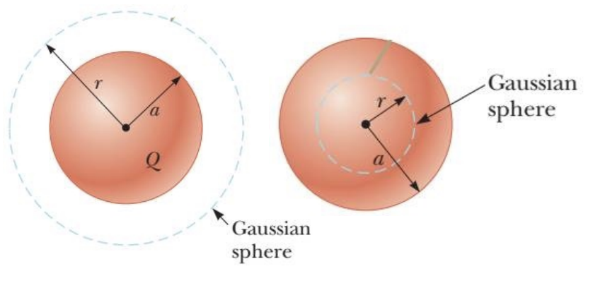

*Proofread by Huỳnh Hà Phương Linh*



## Chap 22
* $Q = ne$
* $\displaystyle \vec F = k_e\frac{q_1q_2}{r^2}\hat r$
* $\displaystyle \vec E = \frac{\vec F}{q} \bigg[\frac{N}{C}\bigg]\bigg[\frac{V}{m}\bigg]$

## Chap 23
* $\displaystyle \vec E = k_e\int \frac{dq}{r^2} \hat r$

### Gauss Law
* $\displaystyle \phi_E = \oint_S \vec E.d\vec A = \frac{q_{in}}{\epsilon_0} \bigg[\frac{N.m^2}{C}\bigg]$

### Field Due to a Spherically Symmetric Charge Distribution

* $r > a:$ $\displaystyle E = \frac{Q}{4\pi\epsilon_0r^2}$
* $r < a:$ $\displaystyle E = \frac{Qr}{4\pi\epsilon_0a^3}$

### Field at a Distance from a Line of Charge
* $\displaystyle E = \frac{2k_e\lambda}{r}$

## Chap 24
* $\displaystyle \Delta K = \int \vec F.d\vec s = \int q.\vec E.d\vec s$
* $\displaystyle \Delta K + \Delta U = 0 \to \Delta U = -\Delta K = -\int q.\vec E.d\vec s$
* $\displaystyle \Delta V = \frac{\Delta U}{q} = -\int\vec E.d\vec s$

### Potential Difference in a Uniform Field
* $\displaystyle \Delta V = E.d$

### The potential difference between points A and B:
* $\displaystyle V_B - V_A = k_eq\bigg[\frac{1}{r_B} - \frac{1}{r_A}\bigg]$
* Choose $r_A \to \infty$ and $V_A = 0:$ $\displaystyle V = \sum_i \frac{kQ_i}{r_i}$
* $\displaystyle E = -\frac{dV}{dx} \to F = -\frac{dU}{dx}$

### Electric Potential for a Continuous Charge Distribution
* $\displaystyle \Delta V = k_e \int \frac{dq}{r} = -\int_A^B \vec E.d\vec s$

### Conductor in Electrostatic Equilibrium
* $E_{inside} = 0$ 
* $V_{inside} = const$
* $\Delta V= 0$ *between any two points on the surface.*
* *Extra charges on the surface.*
* $\displaystyle E = \frac{\sigma}{\epsilon_0}$ ***(Nguyên lý hoạt động của cột ngư lôi)***

## Chap 25

* $V_1 = V2$
* $\displaystyle \frac{q_1}{R_1} = \frac{q_2}{R_2}$
* $\displaystyle \frac{\sigma_1}{\sigma_2} = \frac{q_1}{q_2}\cdot\frac{R_2^2}{R_1^2}$

### Capacitance
* $\displaystyle C = \frac{Q}{\Delta V}$

### Parallel Plate Capacitor

* $\displaystyle E = \frac{\sigma}{\epsilon_0} = \frac{q}{A\epsilon_0}$
* $\displaystyle \Delta V = E.d = \frac{q.d}{A\epsilon_0}$
* $\displaystyle C = \frac{q}{\Delta V} = \frac{A\epsilon_0}{d}$

### Capacitance of a Cylindrical Capacitor

* $\displaystyle C = \frac{l}{2k_e\ln(b/a)}$

### Capacitance of a Spherical Capacitor

* $\displaystyle a \approx b: C \approx \frac{A.\epsilon_0}{d}$ 
* $\displaystyle b \to \infty: C \approx 4\pi\epsilon_0a$

### Capacitors in Parallel

* $Q_{total} = Q_1 + Q2 = (C_1 + C_2).\Delta V$
* $C_{total} = C_1 + C_2$
* $\Delta V_1 = \Delta V_2 = \Delta V$

### Capacitors in Series

* $Q_1 = Q_2 = Q$
* $\Delta V_{total} = \Delta V_1 + \Delta V_2$
* $\displaystyle \frac{1}{C} = \frac{1}{C_1}+ \frac{1}{C_2}$

### Energy Stored in a Capacitor
* $dU = dq\cdot \Delta V$
* $\displaystyle W = \frac{Q^2}{2C} = \frac{Q\Delta V}{2} = \frac{C\Delta V^2}{2}$

### Dielectric
* $\displaystyle C = \frac{\kappa\epsilon_0A}{d}$

### Electric Dipole
* $\vec\tau = \vec p\times\vec E$
* $\vec p = q\cdot\vec d$
* $U = -\vec p\cdot \vec E$

## Chap 26
* $\displaystyle I_{avg} = \frac{\Delta Q}{\Delta t} = \frac{n.q}{\Delta t} = \frac{\frac{n}{V}.V.q}{\Delta t} = n.A.q.v$ 

### Ohm Law
* $\displaystyle J = \sigma.E \to \frac{I}{A} = \sigma.\frac{\Delta V}{l} \to \frac{\Delta V}{I} = \frac{l}{\sigma.A} = R$
* $\displaystyle \sigma = \frac{nq^2t}{m_e} = \frac{1}{\rho}$
* $\displaystyle R = \frac{\rho\cdot l}{A}$
* $\rho = \rho_0[1 + \alpha(T-T_0)] (\alpha >0: metal,\,\ \alpha < 0: semi \,\ conductor)$
* $R = R_0[1+\alpha(T-T_0)]$

### Electric Power (Joule - Lenz)
* $\displaystyle P = I\cdot\Delta V = I^2\cdot R = \frac{\Delta V^2}{R}$