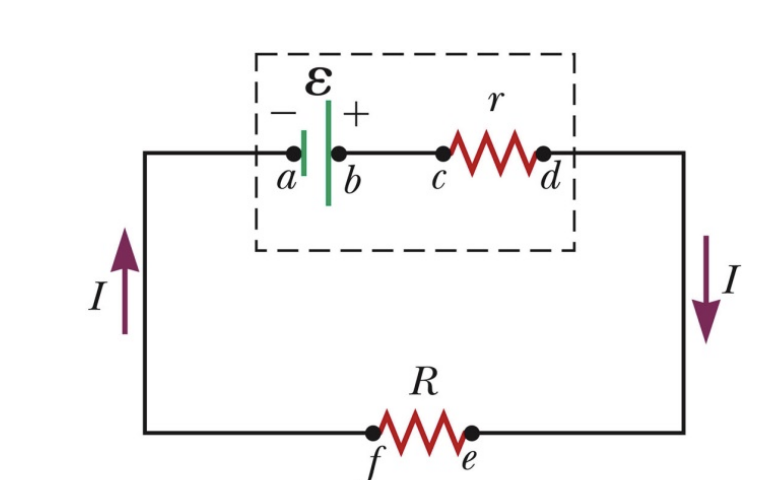
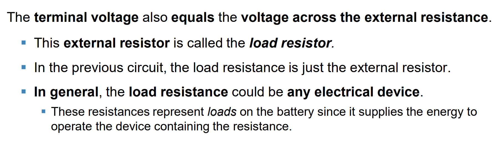
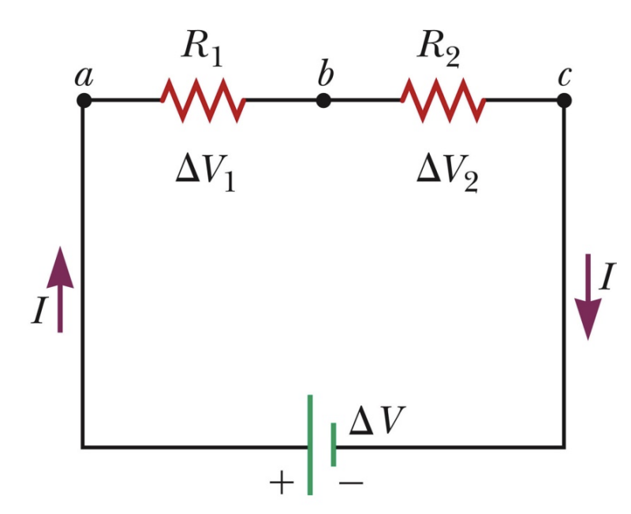
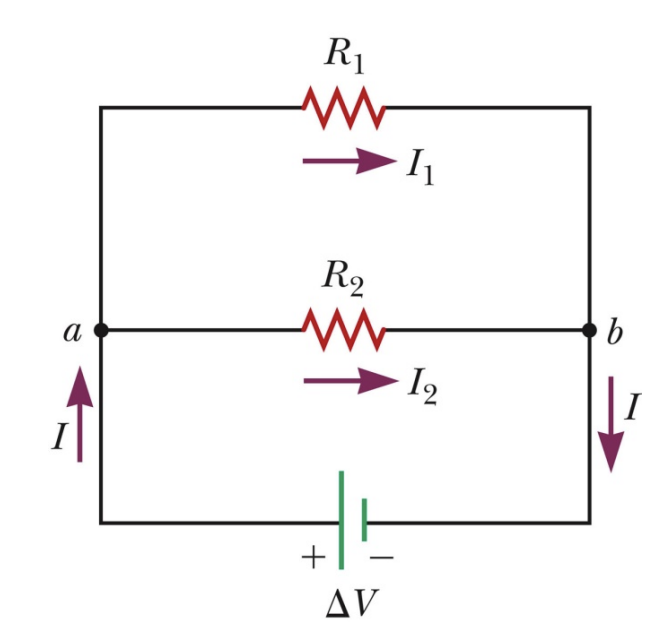
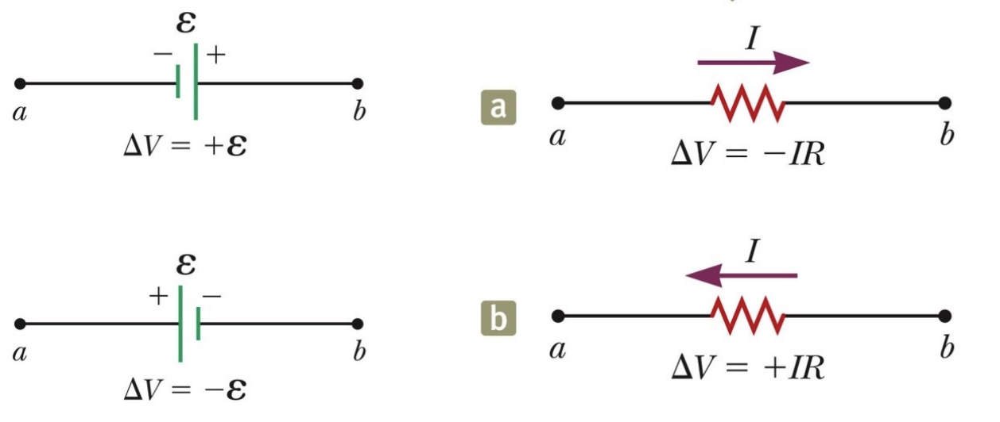
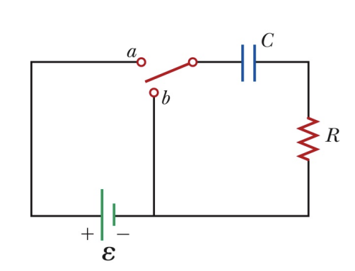

*Proofread by Huỳnh Hà Phương Linh*



## Electromotive force (Suất điện động)

$$
\xi = emf \,\ (volt)
$$

## Internal Battery Resistance

$$
\Delta V = \xi - I.r
$$

$$
I = \frac{\xi}{R+r}
$$

$$
\Delta V = R.\frac{\xi}{R+r}
$$

$$
P = I.\xi = I^2.(R+r)
$$

## Load Resistance

## Combination of resistors
### In Series:

$$
I_1 = I_2 = I
$$

$$
\Delta V = \Delta V_1 + \Delta V_2
$$

$$
R = R_1 + R_2
$$

### In parallel:

$$
\Delta V_1 = \Delta V_2 = \Delta V
$$

$$
I = I_1 + I_2
$$

$$
\frac{1}{R} = \frac{1}{R_1} + \frac{1}{R_2}
$$

## Kirchhoff’s Rules
* **Juntion rule:** $\sum I_{in} = \sum I_{out}$
* **Loop rule:** $\sum \Delta V = 0$

## RC Circuit

* **Loop Rule:**

$$
\xi - \frac{Q}{C} - R.i = 0
$$

$$
\xi - \frac{Q}{C} - R.\frac{dQ}{dt} = 0
$$

$$
\xi - \frac{Q}{C} = R\frac{dQ}{dt}
$$

$$
\xi C - Q = RC\frac{dQ}{dt}
$$

$$
\displaystyle \int_0^t \frac{-dt}{RC} = \int_0^q \frac{dQ}{Q - \xi C}
$$

$$
\ln(\frac{q-C\xi}{-C\xi}) = -\frac{t}{RC}
$$

**Notes:** 
$q(t) = \xi.C(1-e^{\frac{-t}{RC}}) = Q_{max}.(1-e^{\frac{-t}{RC}})$  
$i(t) = \frac{dQ}{dt} = \frac{\xi}{R}.e^{\frac{-t}{RC}}$ 
$\tau = RC (s):$ **time constant**

## Other references
* [MIT Physics 2](https://www.youtube.com/playlist?list=PLyQSN7X0ro2314mKyUiOILaOC2hk6Pc3j)
* [Michel van Biezen](https://www.youtube.com/playlist?list=PLX2gX-ftPVXX7BZOcM1Y2gb8IQrTBrmUB)
* [Khan Academy](https://www.khanacademy.org/science/in-in-class-12th-physics-india)