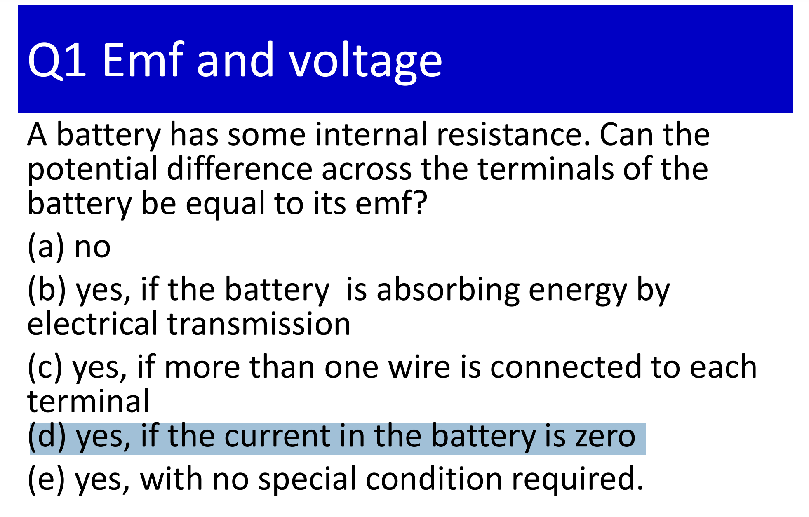
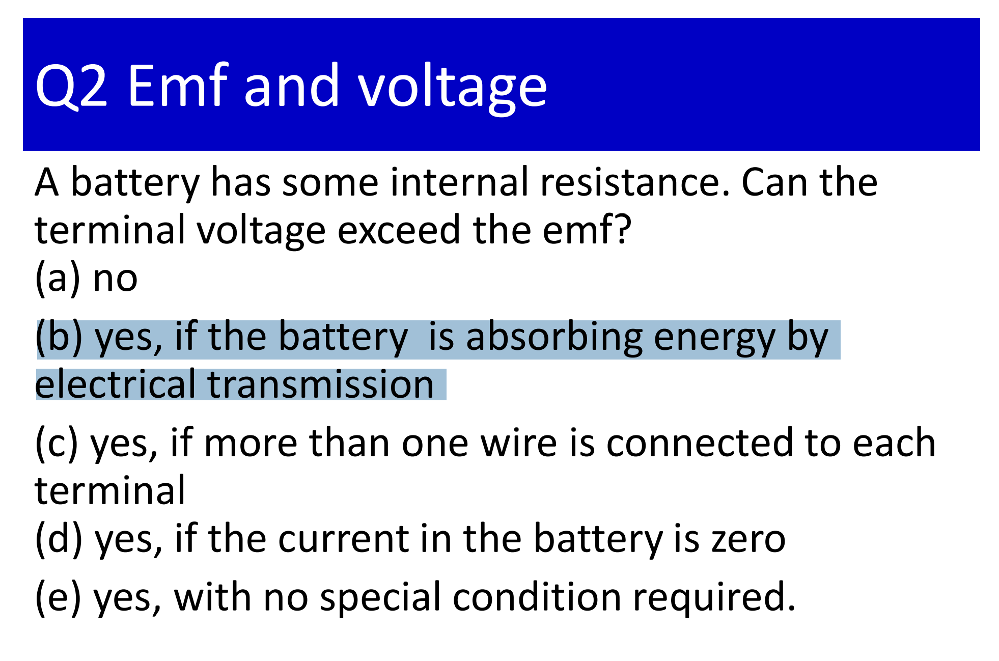
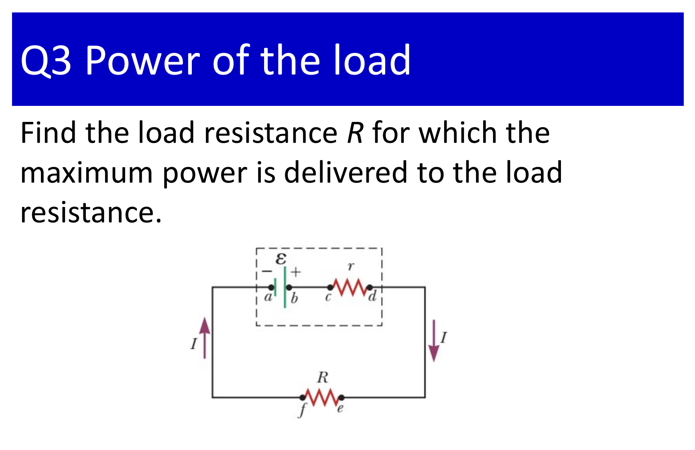
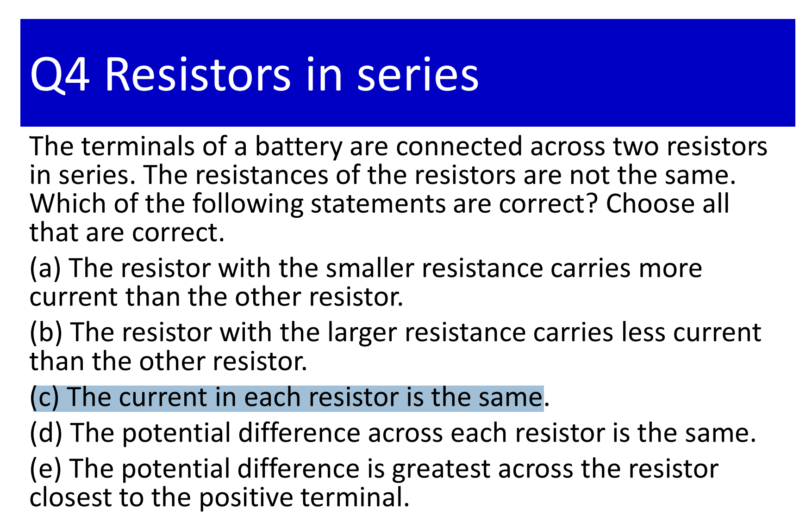
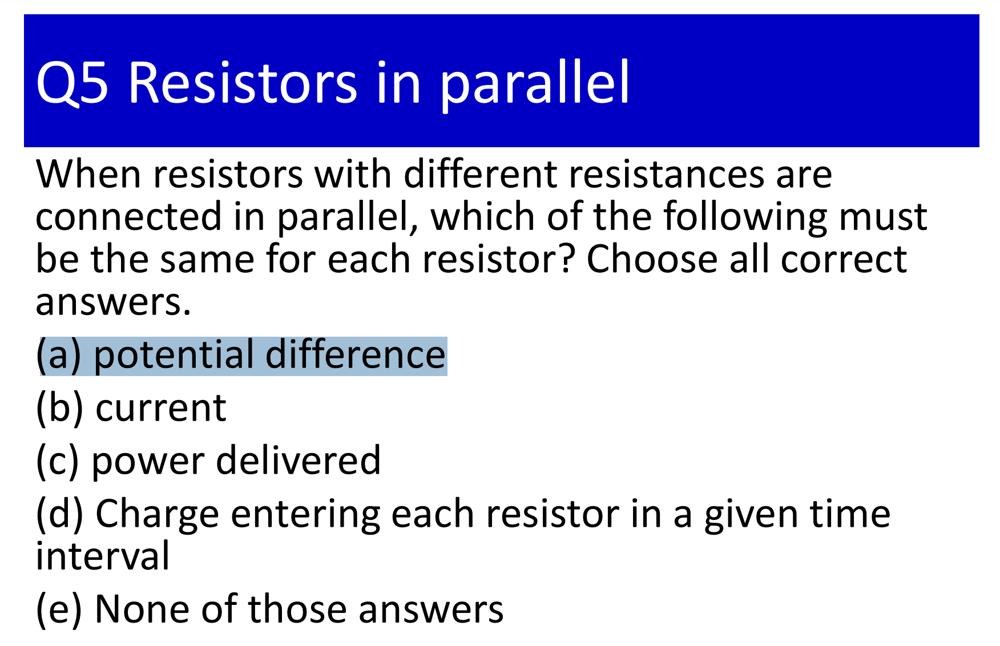
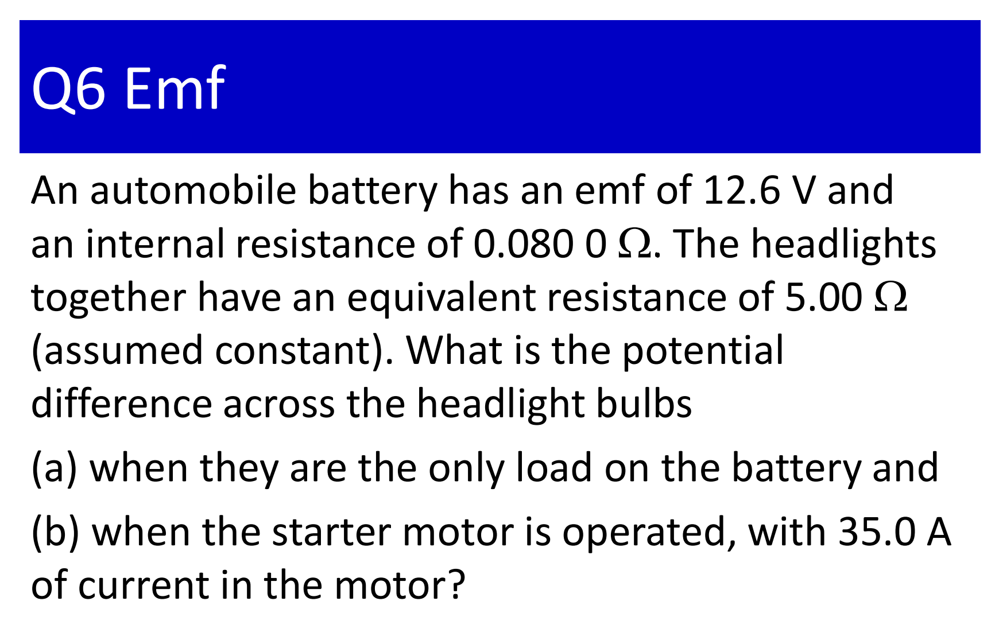
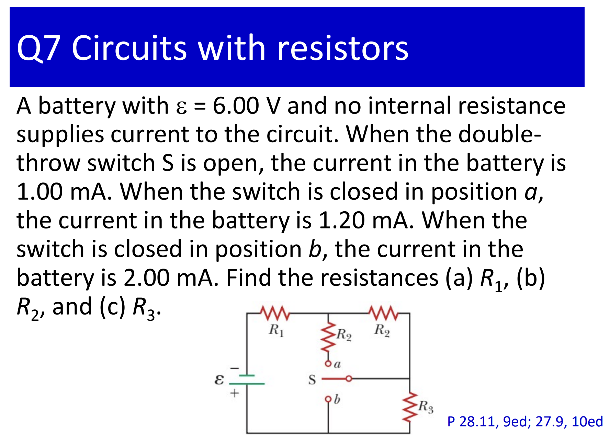
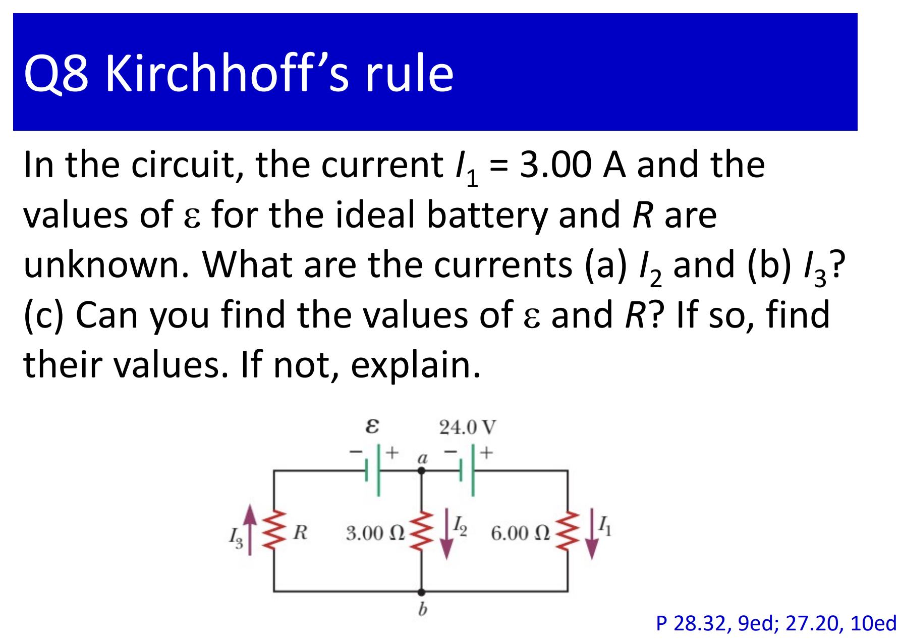
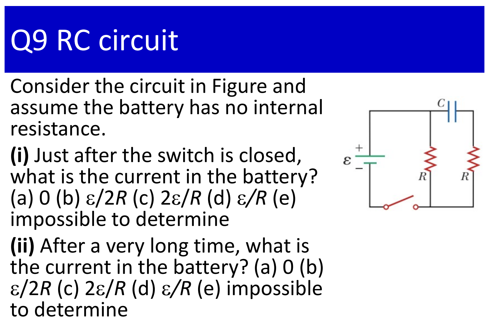
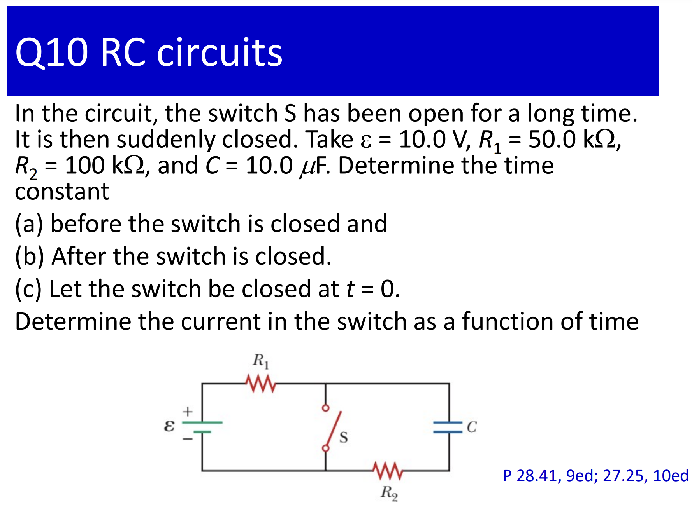



$$
P = I^2R
$$

$$
\displaystyle P = \frac{\Delta V^2}{(R+r)^2}R = \Delta V^2\frac{1}{(\sqrt{R} +\frac{r}{\sqrt{R}})^2} \leqslant \frac{\Delta V^2}{4r}
$$

* The $"="$ exists when $R = r$.

$$
a)\,\ \displaystyle I = \frac{\xi}{R+r} = \frac{12.6}{5 + 0.08} = 2.48 (A)
$$

$$
\Delta V = IR = 2.48 \times 5 = 12.4 (V)
$$

$b)$ Let *$I_1$* be the current flowing through the automobile battery, *$I_2$* be the current flowing through the headlight bulbs. From the **Kirchhoff's law**, we get:

$$
I_1 = I_2 + 35A
$$

$$
\displaystyle \xi = I_1r + I_2R = (I_2 + 35)r + I_2R
$$

$$
\displaystyle I_2 = \frac{\xi - 35r}{R+r} = 1.93(A)
$$

$$
\Delta V = I_2R = 1.93 \times 5 = 9.65(V)
$$

* When $S$ is open $:$

$$
\displaystyle I_1 = 10^{-3} = \frac{6}{R_1+R_2+R_3} (1)
$$

* When $S$ is closed at position $a:$

$$
\displaystyle I_2 = 1.2 \times 10^{-3} = \frac{6}{R_1 + \frac{R_2}{2} + R_3} (2)
$$

* When $S$ is closed at position $b:$

$$
\displaystyle I_3 = 2 \times 10^{-3} = \frac{6}{R_1 + R_2} (3)
$$

* From $(1)(2)(3)$ $\to R_1 =$ $1$ $k \Omega,$ $R_2 = 2$ $k \Omega,$ $R_3 = 3$ $k \Omega.$

* The *potential difference* from $a$ to $b$ following path $I_1:$

$$
V_b - V_a = 24 -I_1\times 6\Omega = 6(V)
$$

* The *potential difference* from $a$ to $b$ following path $I_2:$

$$
V_b - V_a = -3I_2 (V)
$$

* *Therefore* $:$

$$
-3I_2 = 6 \to I_2 = -2(A)
$$

$b)$ $I_3 =I_1 + I_2 = 3-2 = 1(A)$

$c)$ Nooo...Because we don't have enough equations to calculate both $\xi$ and $R.$

$i)$ $C$  
$ii)$ $D$

$a)$ $\tau = RC = (R_1 +R_2)C = 1.5 (sec)$

$b)$ $\tau = R_2C = 0.5(sec)$

$c)$ $\displaystyle I_1 = \frac{\xi}{R_1}$, $\displaystyle I_2 = \frac{\xi}{R_2}e^{\frac{-t}{R_2C}}$

The total current in the switch is $:$
$\displaystyle I = \xi\bigg[\frac{1}{R_1}+\frac{e^{\frac{-t}{R_2C}}}{R_2} \bigg]$