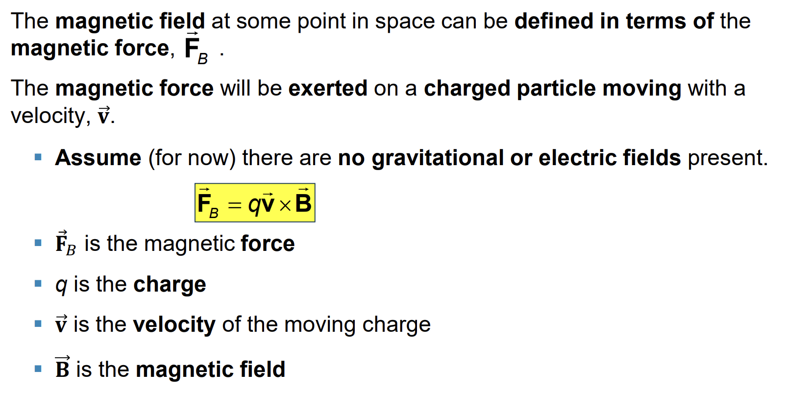
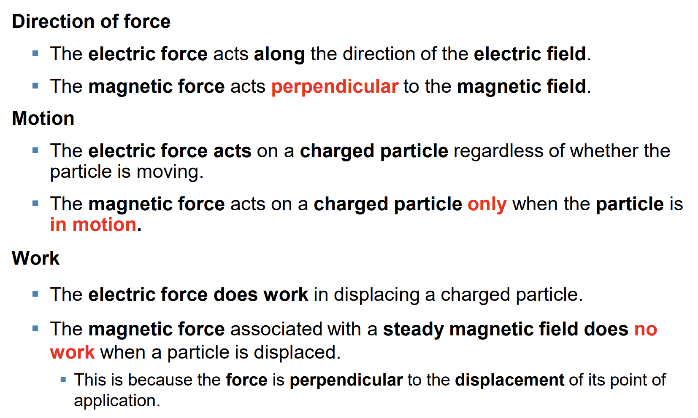
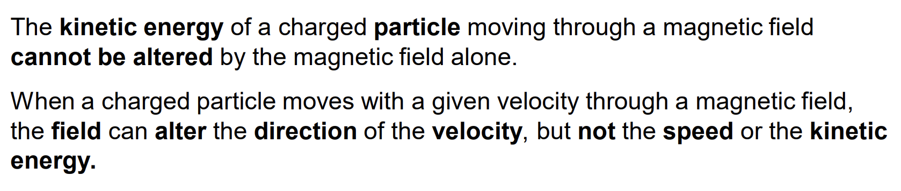
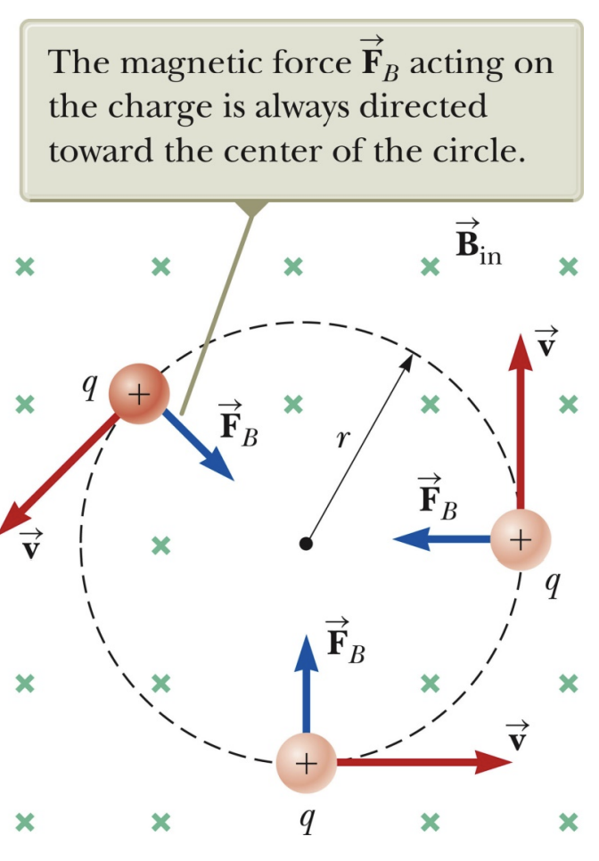
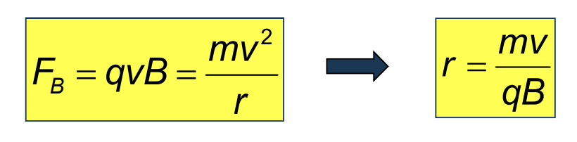
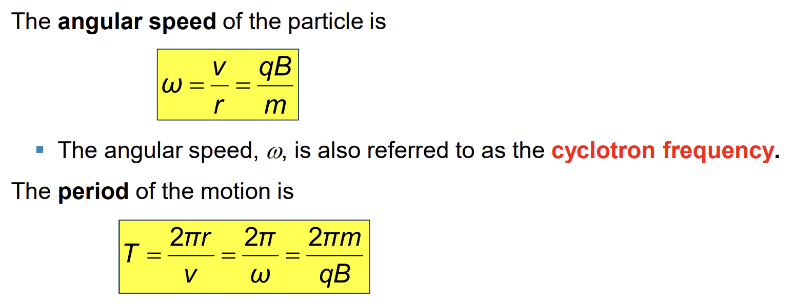
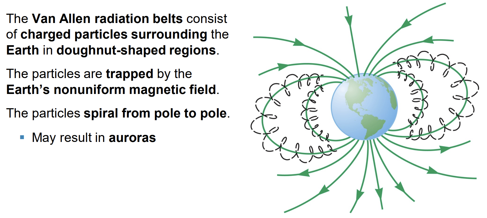



## Magnetic Field

## Direction: Right-Hand rule

## Differences Between Electric and Magnetic Fields

## Units of Magnetic Field

## Charged Particle in a Magnetic Field

## Van Allen Radiation Belts

