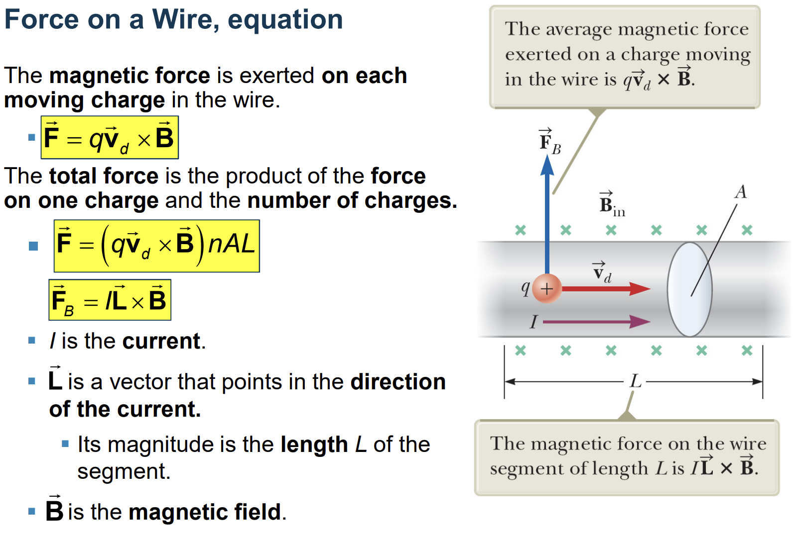
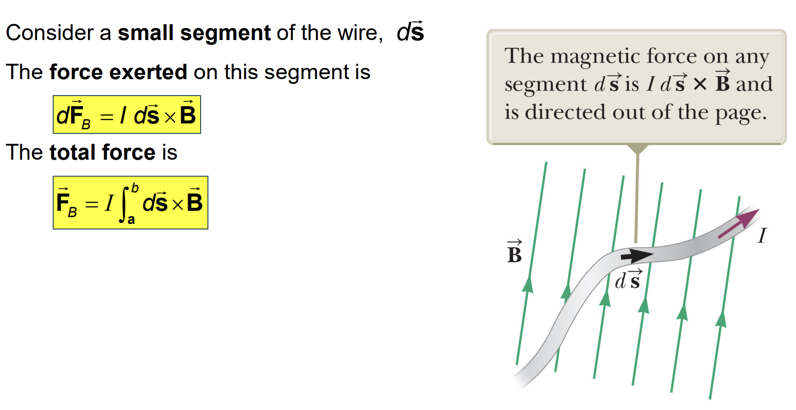
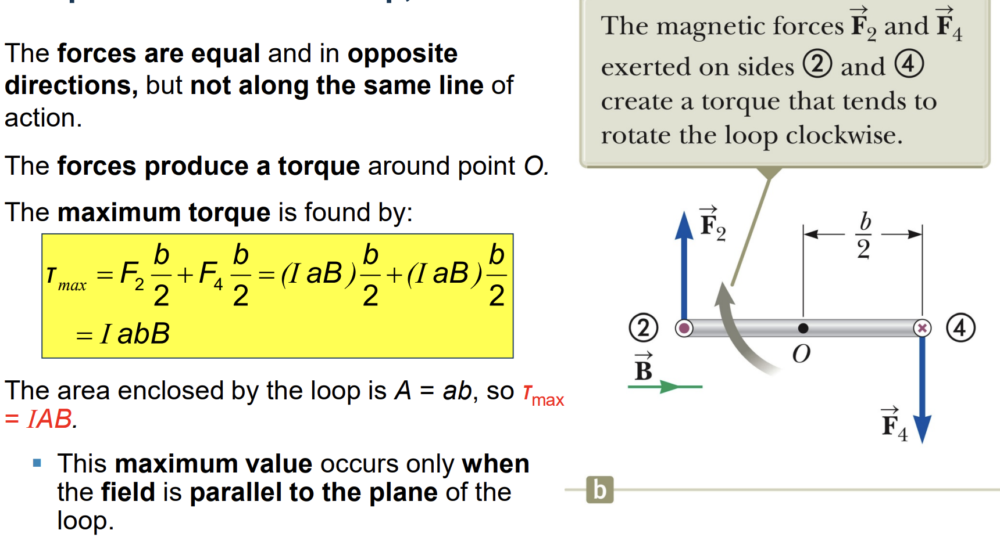
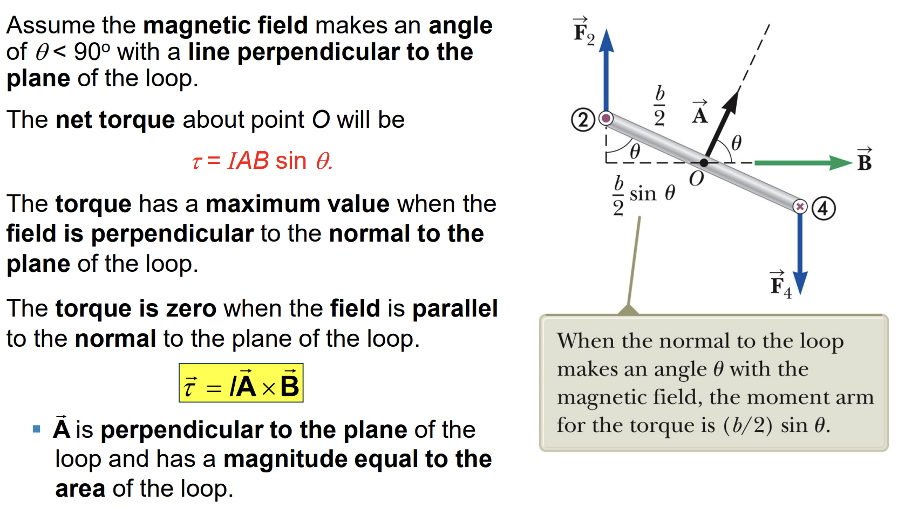
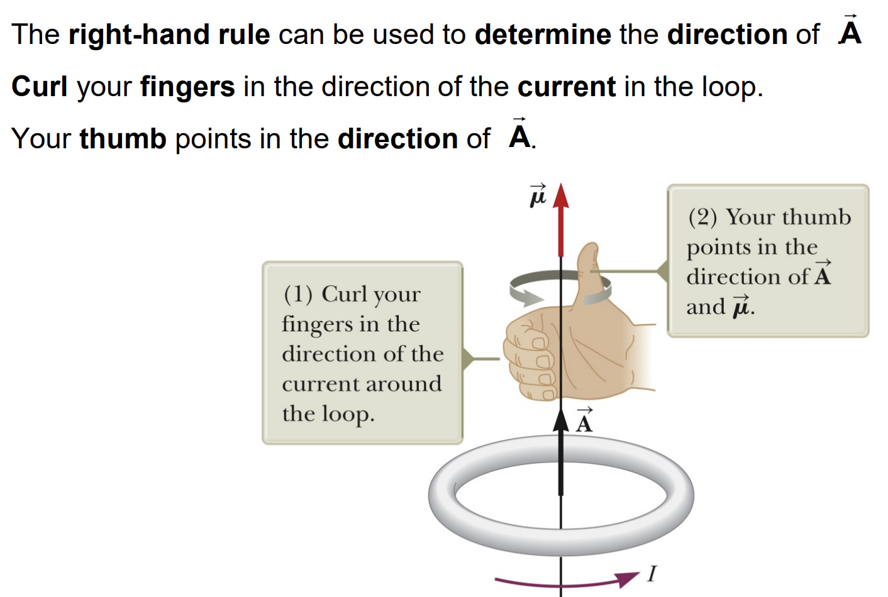
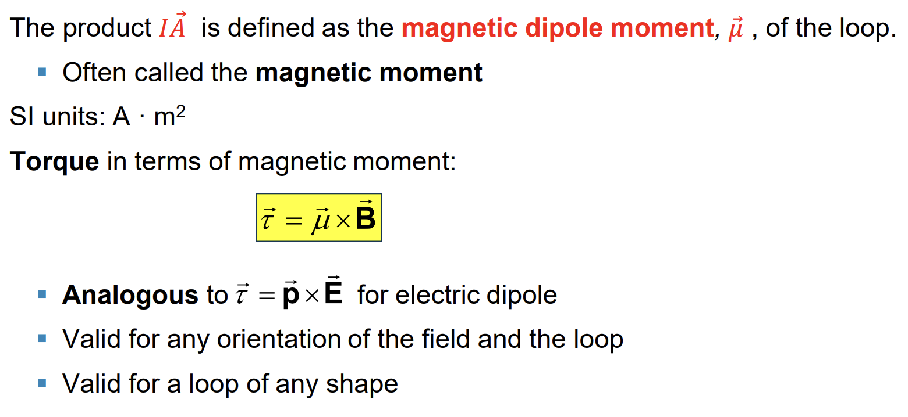
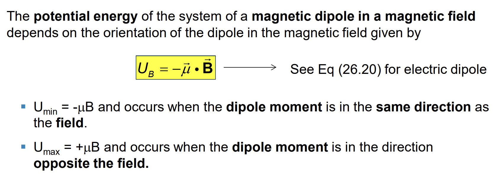
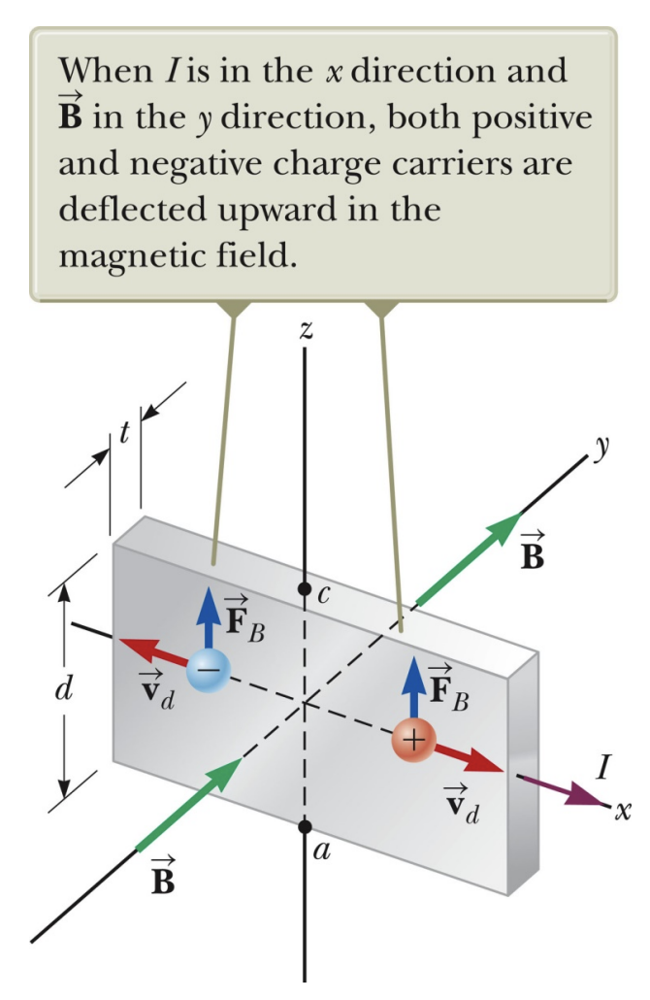
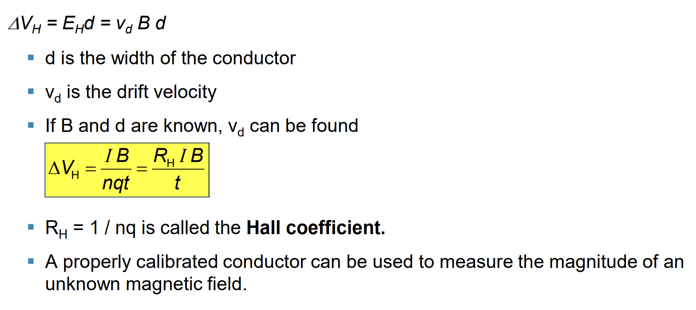



## Force on a Wire

## Torque on a Current Loop

## Direction of $\vec A$

## Magnetic Dipole Moment

## Potential Energy

## Hall Effect
* When a *current* carrying conductor is placed in a *magnetic field*, a *potential difference* is generated in a direction perpendicular to both the *current* and the *magnetic field*. This phenomena is known as the **Hall effect**.

