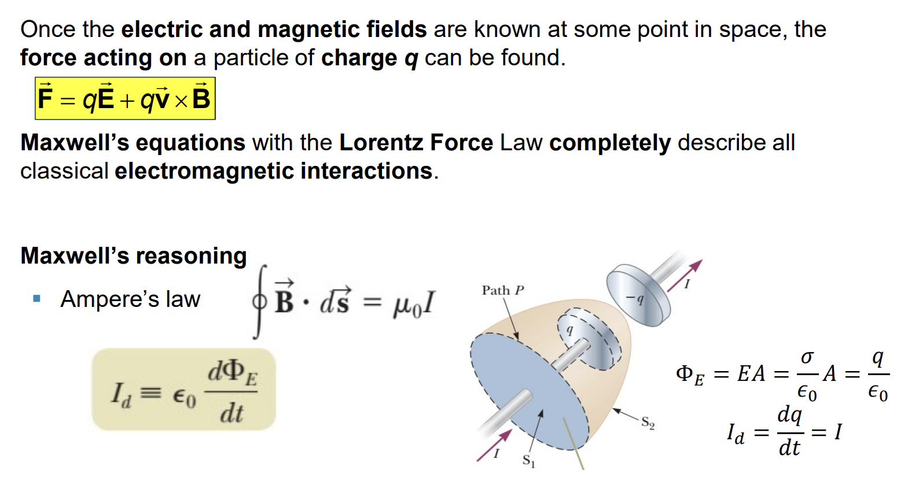



## Chapter 33
### Difference between E & M

### Maxwell’s Equations

### Lorentz Force Law

### Electromagnetic Waves in Free Space

### Plane Electromagnetic Waves

### E to B Ratio

### Properties of EM Waves

### Poynting Vector

### Intensity

### Energy Density

## Assignments Chap 31

 

$i)$ When $S_1$ is closed $(t = 0):$

$$
i = 0
$$

$$
\Delta V_R = Ri = 0
$$

$$
\Delta V_L = L\frac{di}{dt} = \xi
$$

$ii)$ After a very long time $:$

$$
i = \frac{\xi}{R}
$$

$$
\Delta V_R = Ri = \xi
$$

$$
\Delta V_L = L\frac{di}{dt} = 0
$$

$$
|\xi| = \bigg|-L \frac{di}{dt}\bigg| \to L = 2.4 \times 10^{-3} (H)
$$

The magnetic flux through each turn $:$

$$
L = \frac{N\Phi_B}{i} \to \Phi_B = \frac{LI}{N} = 19.2 \mu (Wb)
$$

$S$ is closed for a long time $:$

$$
I = \frac{\xi}{R} = 0.2(A)
$$

After $S$ is opened, we have an $LC$ circuit, by conservation of energy $:$

$$
LI^2 = CU^2 \to L = 0.281(H)
$$

## Assignments Chap 32

The current $:$

$$
i_L = I_{max}sin(\omega t + \varphi)
$$

$$
u_B = \frac{1}{2}Li^2 = \frac{1}{2}L\frac{2(\Delta V_{rms})^2}{(\omega L)^2}sin(\omega t + \varphi)^2
$$

At $t = 0(s):$

$$
u_B = 0 \to sin(\varphi)^2 = 0 \to \varphi = 0
$$

At $t = \frac{1}{180}(s):$

$$
u_B =  \frac{1}{2}Li^2 = \frac{1}{2}L\frac{2(\Delta V_{rms})^2}{(\omega L)^2}sin(\omega t)^2 = 3.8(J)
$$

$a)$ 

$$
\displaystyle \frac{\Delta V_{out}}{\Delta V_{in}} = \frac{IR}{IZ} = \frac{R}{\sqrt{R^2 + \frac{1}{(\omega C)^2}}}
$$

$b)$ When the frequency decreases toward zero, the ratio will go to $0.$

$c)$ When the frequency increases without limit, the ratios will go $1.$

$a)$

$$
f_{res} = \frac{1}{2\pi}\sqrt{\frac{1}{LC}} = 3.56 \times 10^3
(Hz)
$$

$b)$

$$
I_{max} = \frac{\Delta V_{max}}{R} = 5(A)
$$

$c)$

$$
\Delta V_L = Z_L I_{max} =  2.24 \times 10^3 (V)
$$

$$
\frac{\Delta V_1}{\Delta V_2} = \frac{N_1}{N_2} = 2.5 \to \Delta V_1 = 62.5(V)
$$

$$
\frac{I_1}{I_2} = \frac{N_1}{N_2} = 2.5 \to I_1 = 2.5 \frac{U_{R_L}}{R_L} = 0.2(A)
$$

$$
(\Delta V_{R_S})^2 = (\Delta V_S)^2 - (\Delta V_1)^2 \to \Delta V_{R_S} = 49.94(V)
$$

$$
\displaystyle R_s = \frac{\Delta V_{R_S}}{I_1} = 250 (\Omega)
$$