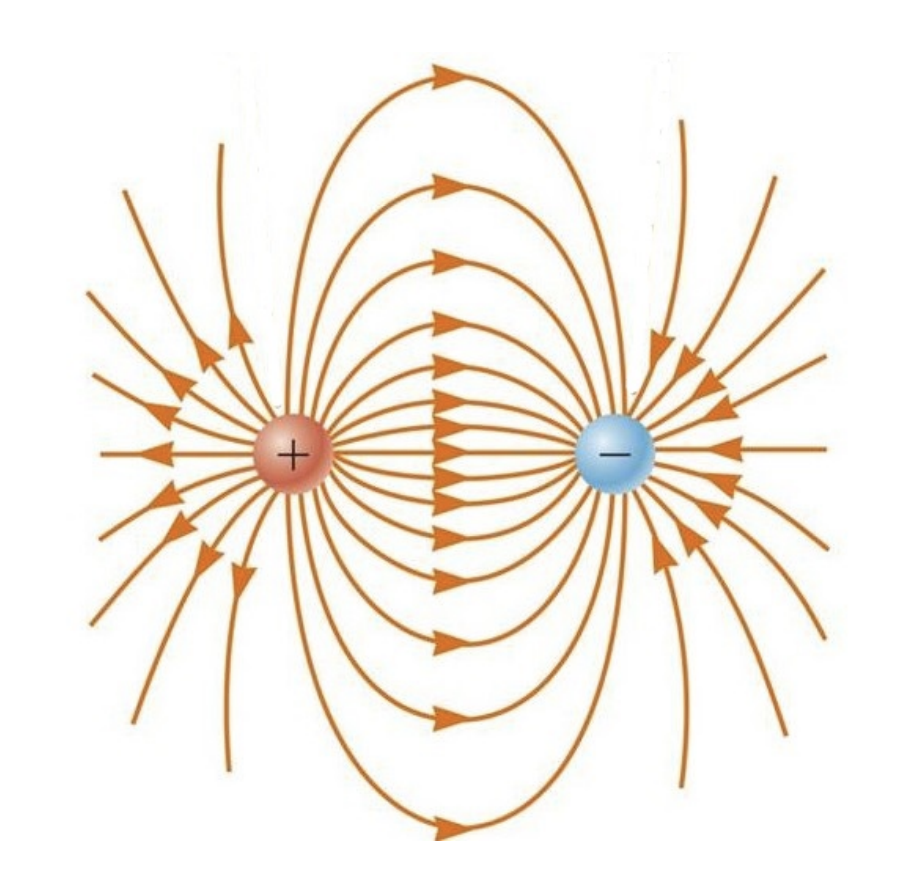

---



# Electric Field
{: .no_toc}

## Introduction
* The ***electric force*** is a ***field force.*** 
* Field forces can ***act through space.***
* The effect is produced even ***with no physical contact*** between objects.

## Definition
* An electric field is said to **exist** in the region of space **around a charged object.** (source charge)
* The **electric field** is defined as the **electric force** on the test charge **per unit charge.**

## Electric Field Lines (Đường sức từ)
* go out from the positive, go into the negative.
* cannot split, merge, cross each other.
* Number of field lines attached a charge ~ the amount of charge.

## Motion of Charged Particles

## Uniform Electric Field (Điện trường đều)
* Eletron's motion is parabolic while between the plates.

## Continuos Charge Distribution

## Assignment

$$
dE = \frac{k.dq}{x^2 + r^2}
$$

$$
\frac{dE_x}{dE} = \frac{x}{(x^2 + r^2)^\frac{1}{2}}
$$

$$
dE_x = \frac{x}{(x^2 + r^2)^\frac{1}{2}}.\frac{k.dq}{x^2 + r^2}
$$

We have $dE_y = 0$. So:

$$
E = E_x = \int dE_x
= \int \frac{kx.dq}{(x^2 + r^2)^\frac{3}{2}} = \frac{kx}{(x^2 + r^2)^\frac{3}{2}}.Q
$$

## New Words
* **radial altitude:** Máy đo độ cao vô tuyến
* **vanish:** biến mất

## Other references
* [MIT Physics 2](https://www.youtube.com/playlist?list=PLyQSN7X0ro2314mKyUiOILaOC2hk6Pc3j)
* [Michel van Biezen](https://www.youtube.com/playlist?list=PLX2gX-ftPVXX7BZOcM1Y2gb8IQrTBrmUB)
* [Khan Academy](https://www.khanacademy.org/science/in-in-class-12th-physics-india)