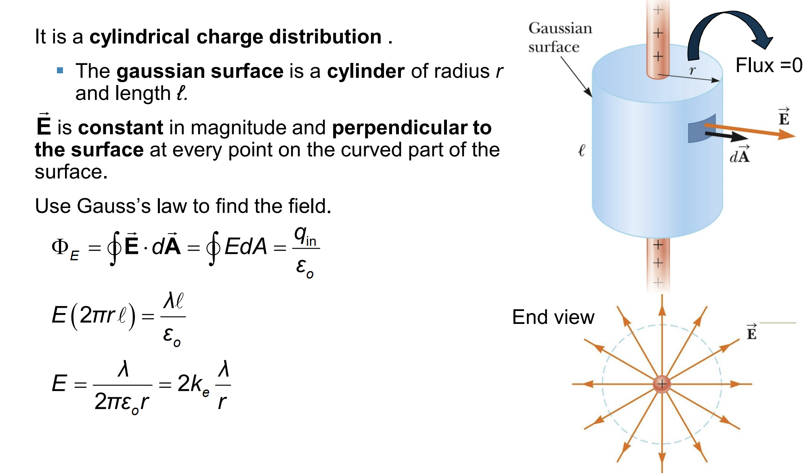
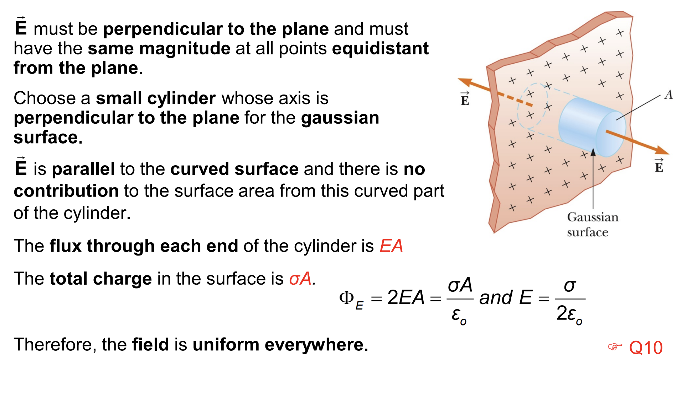
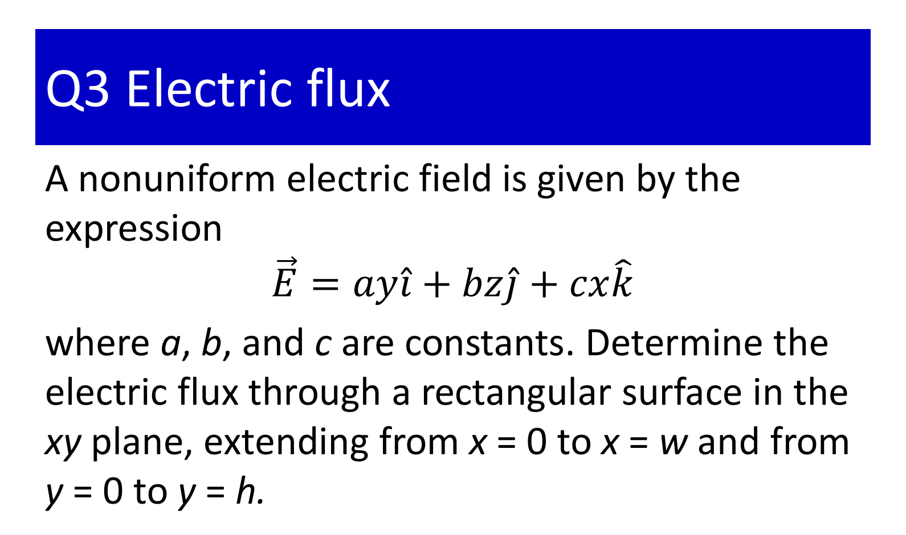



## Field at a Distance from a Line of Charge

## Field Due to a Plane of Charge

## Assignments
### Exercise Chap 23
#### Question 3
{: .no_toc}

**We have the electric flux through a rectangular surface in xy plane. Therefore:**
$$
\vec n = \vec k
$$

$$
\int \vec E. \vec n. dA = \int_0^w
\int_0^h c.x.dx.dy = c\int_0^w x.dx \int_0^h dy = c.\frac{w^2}{2}.h
$$

## Other references
* [MIT Physics 2](https://www.youtube.com/playlist?list=PLyQSN7X0ro2314mKyUiOILaOC2hk6Pc3j)
* [Michel van Biezen](https://www.youtube.com/playlist?list=PLX2gX-ftPVXX7BZOcM1Y2gb8IQrTBrmUB)