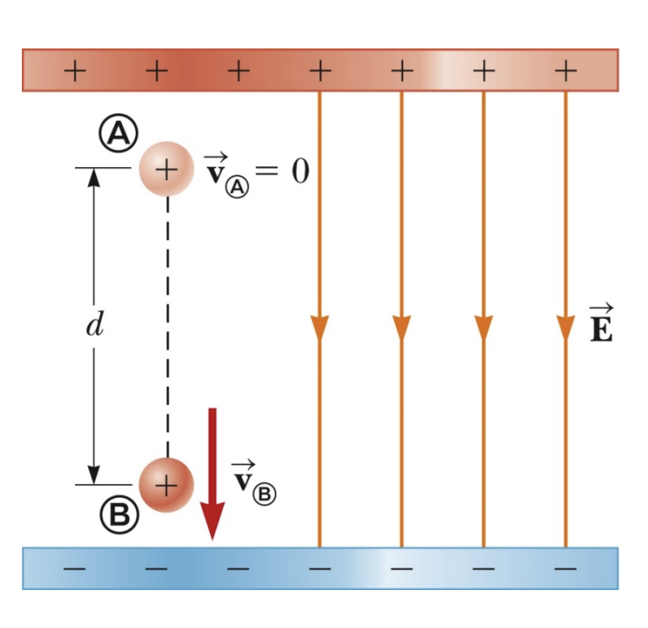
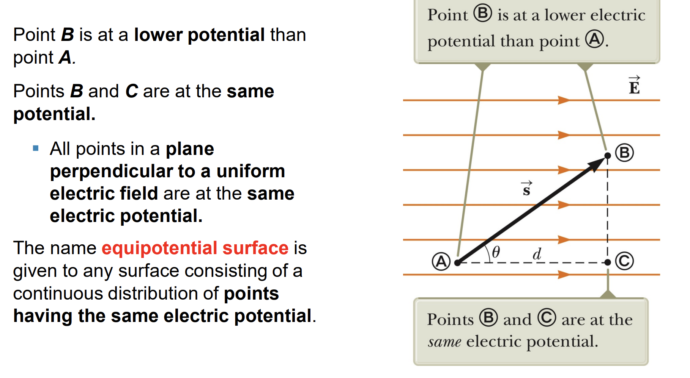
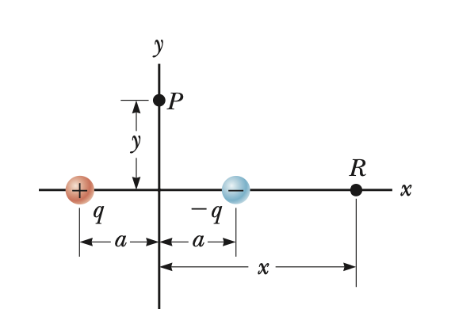
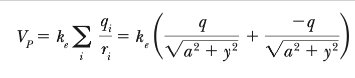



## Work (Work done by the field)

$$
\displaystyle W_{field} = \int \vec F. d\vec s = \int F.ds.cos\theta = \int_{line} q.\vec E. d\vec s
$$

## Work - KE theorem of a particle

$$
W_{field} = \Delta K = K_f -K_i
$$

**System = a charge + the field : isolated**
$$
\Delta K - W_{field} = 0 \, (W_{field} = \Delta U)
$$

$$
\Delta K + \Delta U = 0 \to \Delta E = 0
$$

$$
\displaystyle \Delta U = - \int_{initial}^{final} q.\vec E. d\vec s = U_f - U_i = q.\Delta V
$$

$$
\to \Delta V = \frac{\Delta U}{q} = V_f - V_i
$$

**Therefore:**
 
$$ 
\displaystyle Choose \, V_i = 0 \to V_f = -\int_i^f \vec E.d \vec s
$$

**[energy]** = 1eV = 1,6.10^{-19} (J)
**[electric field]** = $\frac{V}{m}$ = $\frac{N}{C}$

## Charged Particle in a Uniform Field

$$
\displaystyle \Delta V = -\int_i^f \vec E.d\vec s = - \int_i^f E.ds
$$

$$
\displaystyle -E \int_i^f ds = -E.d < 0 \to V_f < V_i
$$

## Equipotential Surface (Mặt đẳng thế)

## Potential and Point Charges

$$
\displaystyle \Delta V = -\int_A^B \vec E.d\vec s = -\int_{circular}\vec E. d\vec s - \int_{radial}\vec E. d\vec s 
$$

$$
\displaystyle \int_{circular}\vec E. d\vec s = 0
$$

$$
\displaystyle = -\int_{r_A}^{r_B}\frac{kQ.dr}{r^2}
$$

$$
= kQ.(\frac{1}{r_B} - \frac{1}{r_A}) = V_B - V_A
$$

## Notes
* **Vecto** $\bot$ với **mặt cong** $\Leftrightarrow$ **Vecto** $\bot$ **tiếp tuyến của mặt cong tại điểm đó.**
* **Orthonomal:** trực chuẩn
* **Potential energy** of the system: 
    * **Charge**
    * **Field**

## System of charges
$$
\displaystyle \Delta V = -\int E_{net}.d \vec s = - \int(\Sigma \vec E).d \vec s
$$

$$
\displaystyle = -\Sigma \int\vec E.d\vec s = \Sigma \Delta V
$$

Choose $V_{\infty} = 0:$
 
$$
V = \Sigma\frac{k.Q_i}{r_i}
$$

## Assignments

## Other references
* [MIT Physics 2](https://www.youtube.com/playlist?list=PLyQSN7X0ro2314mKyUiOILaOC2hk6Pc3j)
* [Michel van Biezen](https://www.youtube.com/playlist?list=PLX2gX-ftPVXX7BZOcM1Y2gb8IQrTBrmUB)
* [Khan Academy](https://www.khanacademy.org/science/in-in-class-12th-physics-india)
