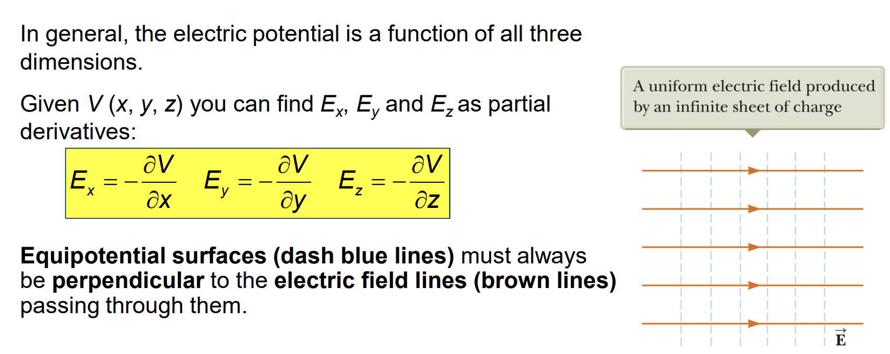
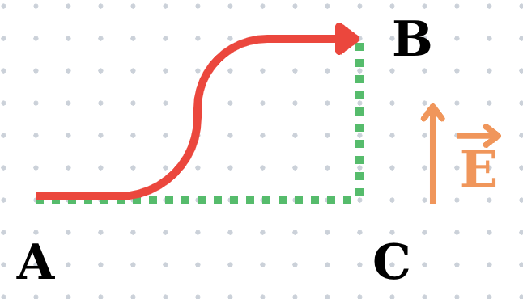
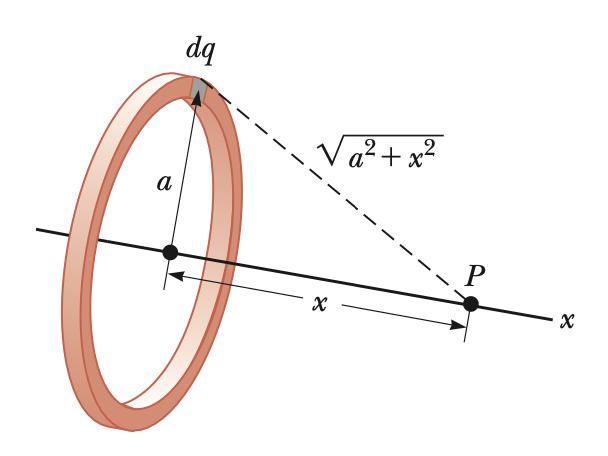
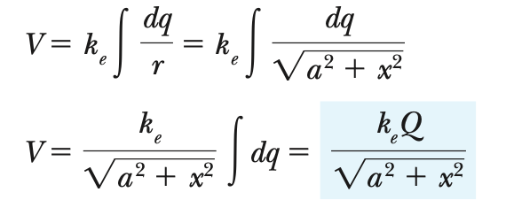
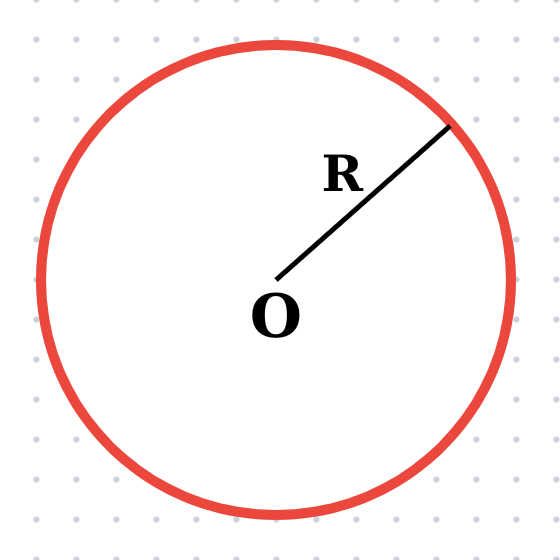
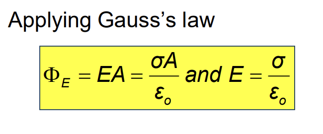
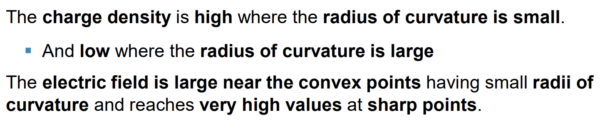



## Finding E from V

## Assignments
### Problem 1

$$
E = \frac{\lambda}{2.\pi.\epsilon_0.r}
$$

$$
\displaystyle \Delta V = -\int_A^B \vec E.d\vec s = -\int_C^B \vec E.d\vec s = -\int_C^B E.dr
$$

$$
\displaystyle = -\int_{r_{a}}^{r_b} \frac{\lambda}{2\pi.\epsilon_0.r}.dr
$$

$$
Choose \,\  r_a \,\ where \,\ V_A = 0:
$$

$$
V(r) = -\frac{lambda}{2\pi\dot\epsilon_0}.lnr +const
$$

### Problem 2

### Problem 3

    
$$
r \geqslant R: E(r) = \frac{1}{4\pi\epsilon_0}.\frac{Q}{r^2}
$$

$$
r < R: E(r) = \frac{1}{4\pi\epsilon_0}.\frac{Q.r}{R^3}
$$

$r \geqslant R:$

$$
\displaystyle \Delta V = -\int_A^B \vec E.d \vec s = -\int_A^B E.dr
$$

$$
= -\frac{Q}{4\pi.\epsilon_0}.(\frac{1}{r_a^2} - \frac{1}{r_b^2})
$$

$$
V_{\infty} = 0 \to V(r) = \frac{1}{4\pi \epsilon_0}.\frac{Q}{r}
$$

## Conductor in electrostatic equilibrium
* $\vec E_{inside} = 0$
* $V_{inside} = 0$
* Extra charges on the surface.
 **Notes:** 
$\vec E$ is vertical because if not, it will create an angle so it will have the tangent component so it will move which is illogical with "electrostatic" (No moving charges)
$\to \vec E \bot$ surface

## Irregularly Shaped Objects

* **Nguyên lý hoạt động của cột ngư lôi**
* **Vì vật nhọn thì $\sigma$ sẽ lớn $\to E$ lớn $\to q$ lớn $\to$ dễ tích điện.** 

## Notes:
* **Solid sphere $\to$ insulating.**
* **If conductor $\to$ charges on surface.**

## Other references
* [MIT Physics 2](https://www.youtube.com/playlist?list=PLyQSN7X0ro2314mKyUiOILaOC2hk6Pc3j)
* [Michel van Biezen](https://www.youtube.com/playlist?list=PLX2gX-ftPVXX7BZOcM1Y2gb8IQrTBrmUB)
* [Khan Academy](https://www.khanacademy.org/science/in-in-class-12th-physics-india)