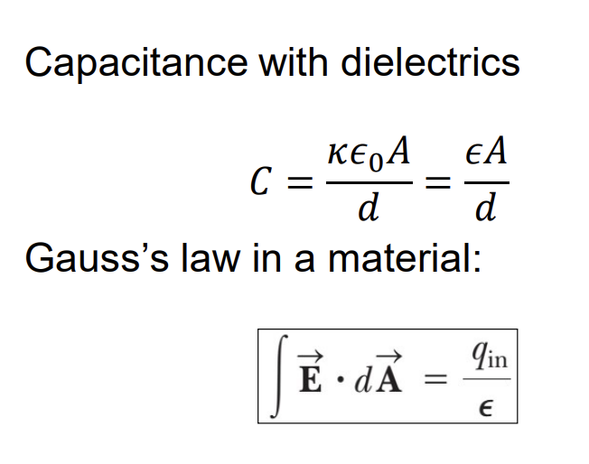



## Electric Dipole

* $F = qE$
* $\vec F_{net} = 0$
* $\tau_{net} = p.E.sin\theta$
* **Electric dipole moment:** $\vec p = q.\vec d$
* **Torque on the dipole:** $\vec \tau = \vec p. \vec E$
* **Potential energy:** $U = -\vec p. \vec E$

## Polar Molecule

## Other references
* [MIT Physics 2](https://www.youtube.com/playlist?list=PLyQSN7X0ro2314mKyUiOILaOC2hk6Pc3j)
* [Michel van Biezen](https://www.youtube.com/playlist?list=PLX2gX-ftPVXX7BZOcM1Y2gb8IQrTBrmUB)
* [Khan Academy](https://www.khanacademy.org/science/in-in-class-12th-physics-india)