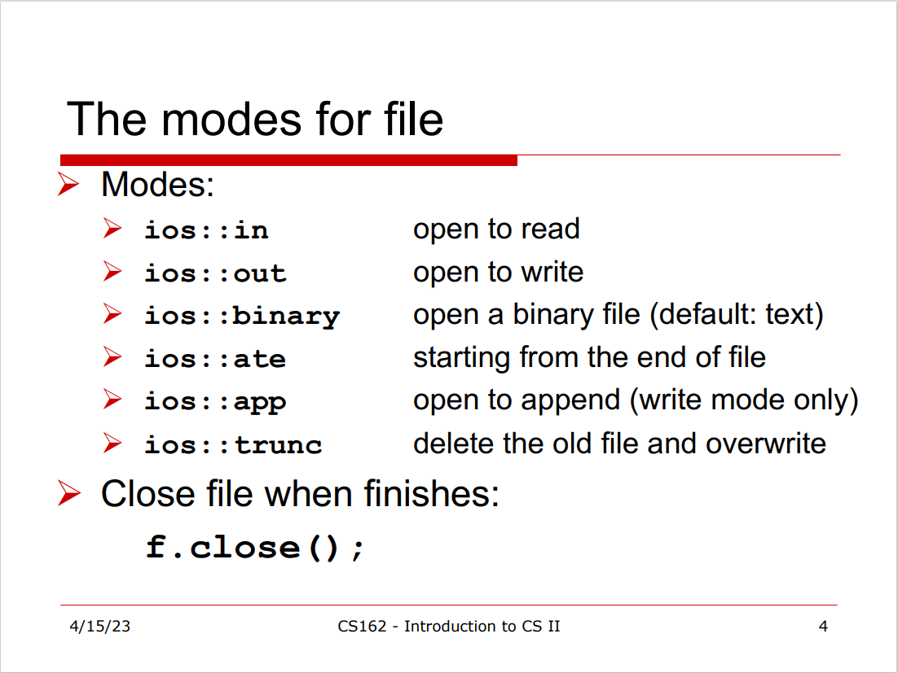
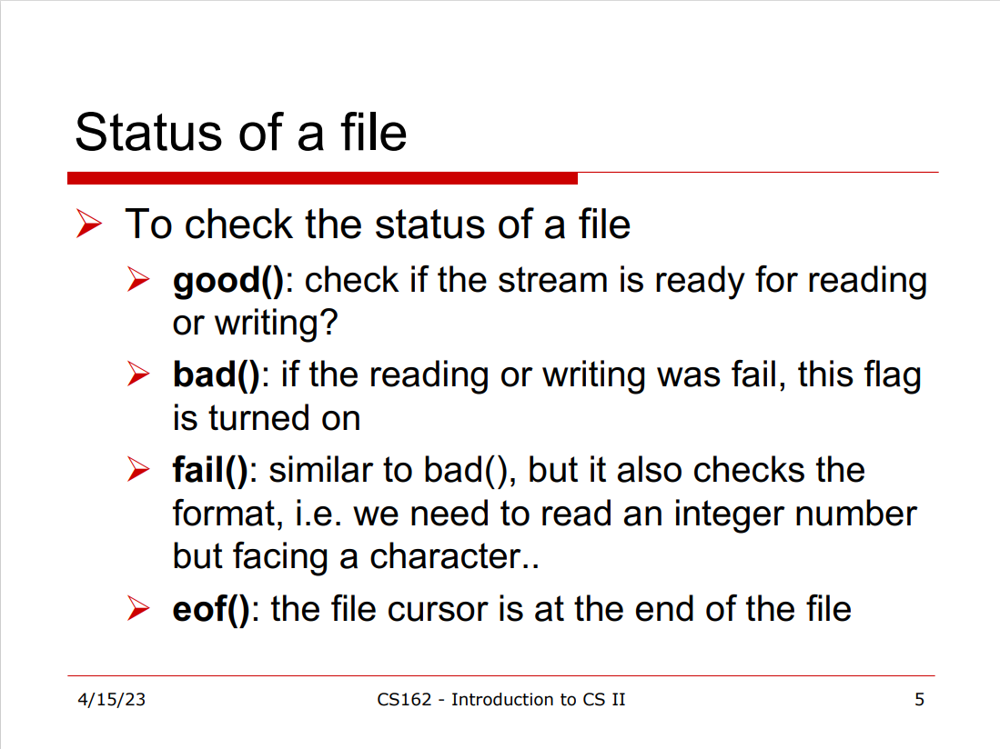
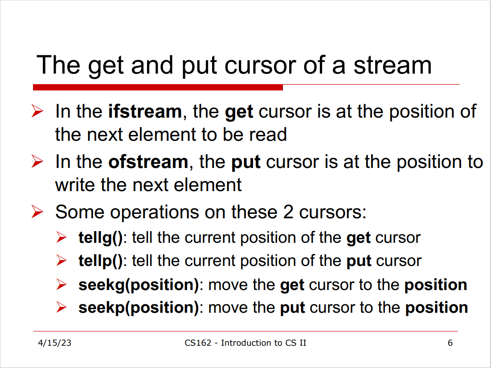
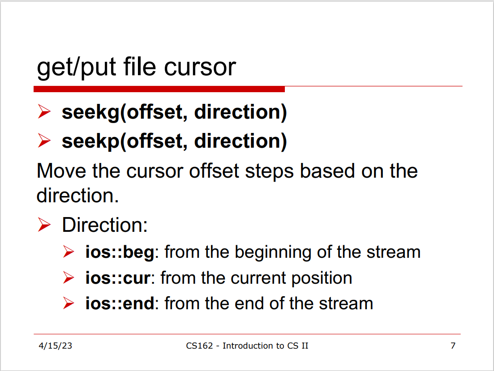
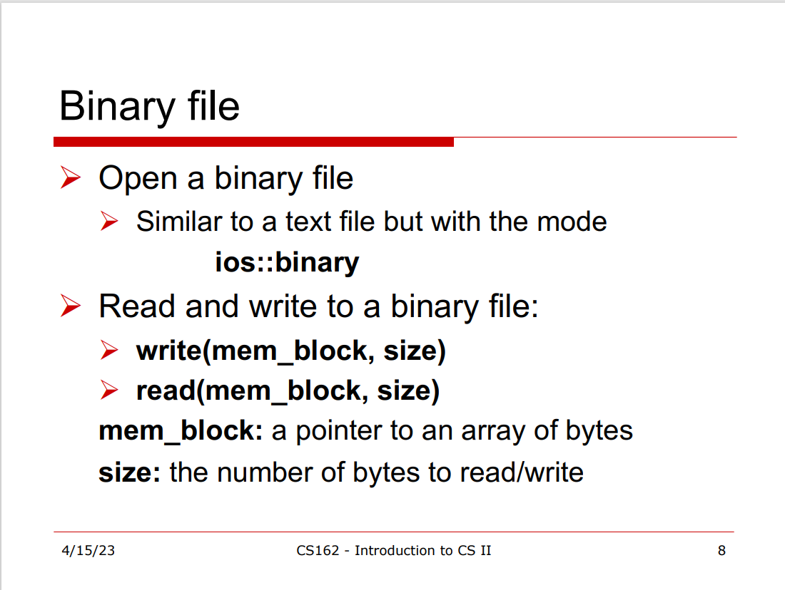

---
layout: post
title: CS162 - 8B
parent: Introduction to Computer Science II
grand_parent: Semester I
--- 



## Lời mở đầu

Trong tiết học hôm nay chúng ta học về ***Binary file***.

## Review textfile


ifstream fin;
ofstream fout;

fin.open("Input.txt");
fout.open("Output.txt");

fin>>t;
fout<<"Hello";

fin.close();
fout.close();


## Một số ngữ pháp cơ bản

## Problem

Cho một binary file với 4 bytes đầu là số nguyên dương $N$. Với mỗi 4 bytes sau đó trong $N$ cụm 4 bytes, cụm thứ $i$ là số $a_i$. Người dùng nhập một số $k$ từ ``std::cin``, hãy ghi ra ``std::cout`` số nguyên $a_k$.

### Tạo file binary (do người ra đề tạo)


#include <iostream>
#include <fstream>

using namespace std;

int main() {
    ofstream fout;
    fout.open("Output.dat", ios::binary);
    
    if(fout.is_open()) {
        int n;
        cout << "Pls input number n: ";
        cout<<<n;
        
        int *a = new int[n];
        for(int i=0; i<n; i++) {
            cin>>a[i];
            cout << "Pls input an int: ";
            cin >> a[i];
        }
        
        fout.write((char*) &n,     sizeof(n));
        fout.write((char*)  a, n * sizeof(a));
        
        delete[] a;
    }
    fout.close();
}


### Solution


#include <iostream>
#include <fstream>

using namespace std;

int main()
{
    ifstream fin;
    fin.open("Output.dat", ios::binary);
    
    if(fin.is_open()) {
        int n;
        fo.read((char*) &n, sizeof(n));

        int k;
        cin>>k;
        unsigned int pos = sizeof(n) + k * sizeof(int);
        if(k < 0 || k >= n)
        {
            cout<<"Out of range!";
            fin.close();
            return 0;
        }

        fo.seekg(pos, ios::beg);
        int ans;
        fo.read((char*) &ans, sizeof(ans));
        cout<<ans;   
        fin.close();
    }
    return 0;
}

