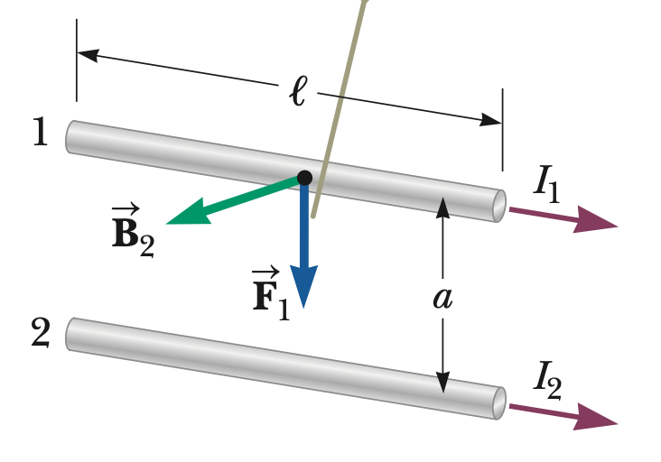
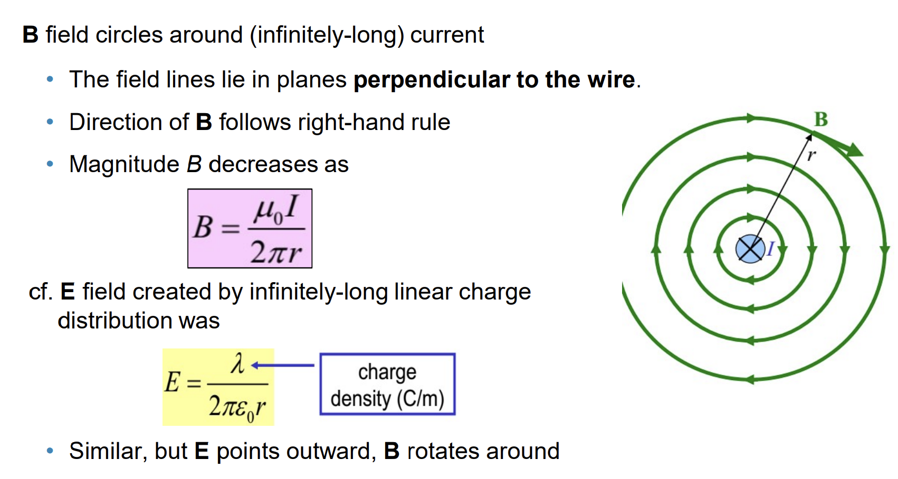
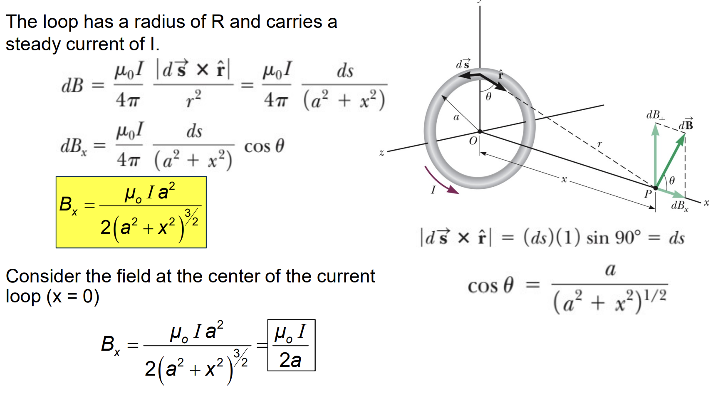
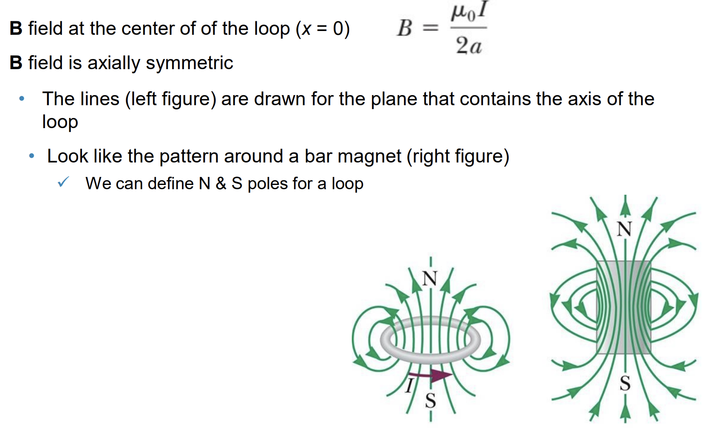
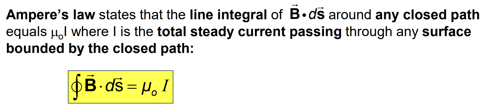
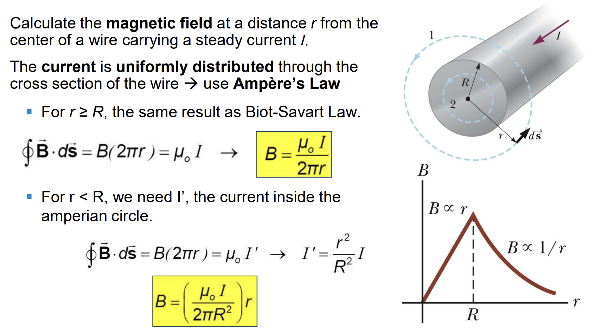
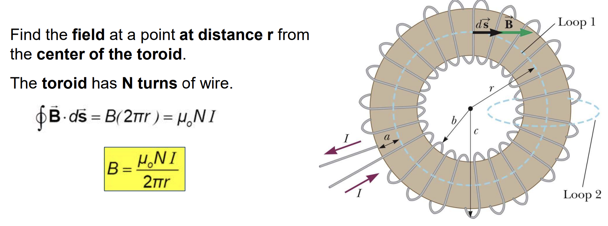
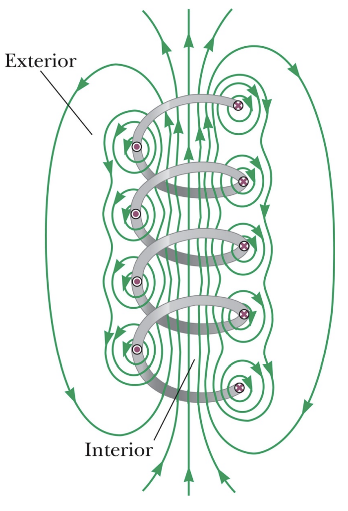
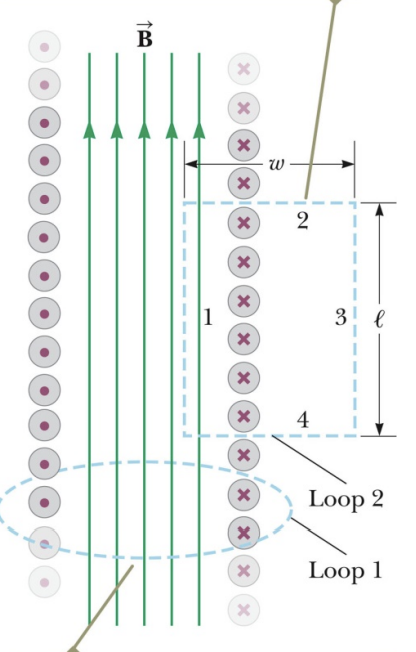
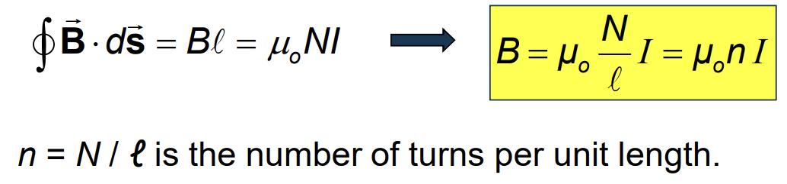



## Magnetic Force Between Two Parallel Conductors

$$
\vec F_1 = I_1\vec l \times \vec B_2
$$

$$
\to F_1 = I_1lB
$$

$$
B_2 = \frac{\mu_0I_2}{2\pi a}
$$

$$
\frac{F_1}{l} = \frac{\mu_0I_1I_2}{2\pi a}
= \frac {2\times10^{-7} (N)}{1(m)} = \frac{\mu_0 (1A)^2}{2\pi (1m)}
$$

$\Rightarrow$ **the definition of Ampere**

**Parallel conductors carrying currents in the same direction attract each other, and parallel conductors carrying currents in opposite directions repel each other.**

## Magnetic Field for a Long, Straight Conductor

## Magnetic Field for a Circular Current Loop

## Magnetic Field Lines for a Loop

## Ampere’s Law

## Long Wire with Finite Thickness

## Magnetic Field of a Toroid

## Magnetic Field of a Solenoid
* **The magnetic field lines resemble that of a magnet.**

* **Uniform field:** parallel and equally spaced

