
## Review Ampere's Law
* **Infinite current sheet:**

$$
B = \frac{\mu_0 J}2
$$

* **Two parallel infinite current sheets:**

$$
B = \mu_0J
$$

* **Solenoid:**

$$
B = \mu_0 n J
$$

## Magnetic Flux
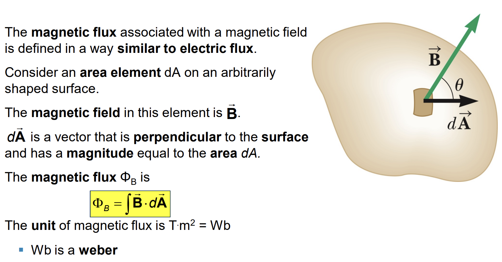

## Gauss’ Law in Magnetism
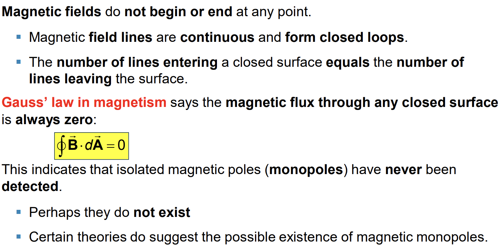

## Assignments - Chapter 29

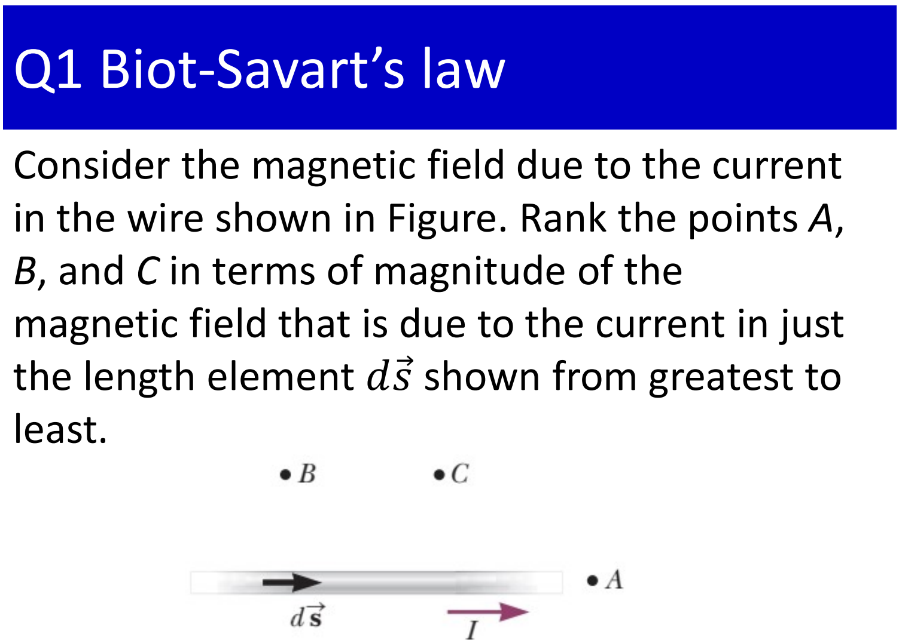

$$
B_B > B_C > B_A = 0
$$

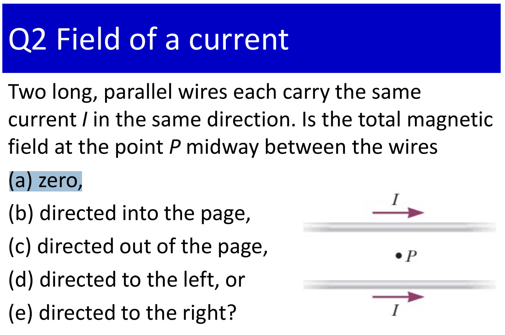

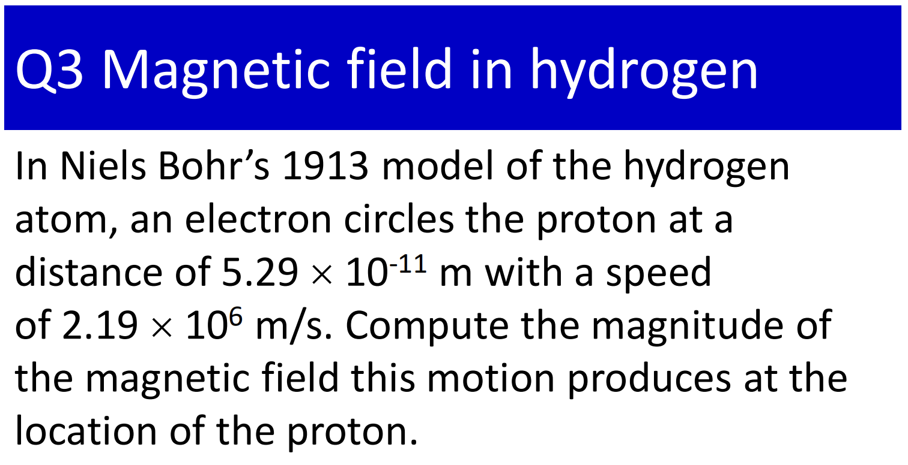

$$
\displaystyle B = \frac{\mu_0I}{2r} = \frac{\mu_0\frac{e}{T}}{2r} = \frac{\mu_0\frac{ev}{2\pi r}}{2r} = 12.5(T)
$$

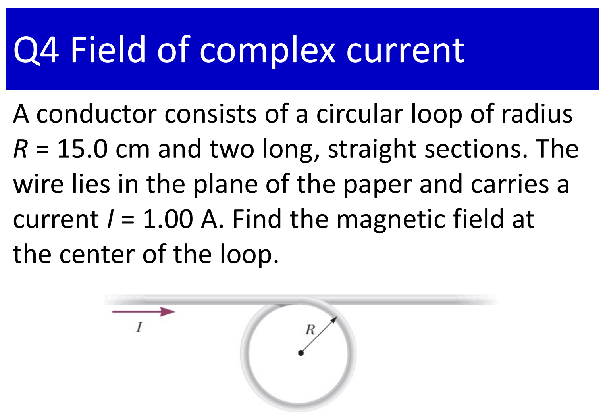

$$
\vec B_{total} = \vec B_{straight} + \vec B_{circular}
$$

$$
B_{total} = B_{straight} + B_{circular}
$$

$$
B_{total}= \frac{\mu_0I}{2r} +  \frac{\mu_0I}{2\pi r} = 5.52 \times 10^{-6} (T)
$$

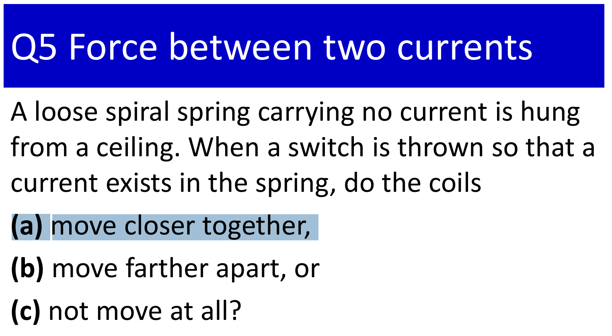

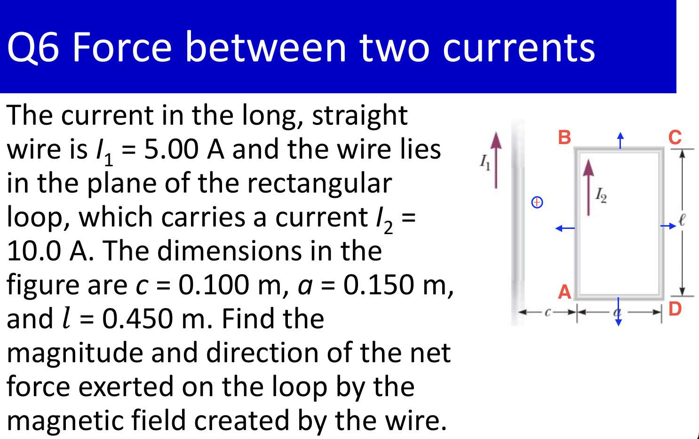
   

* The direction of forces can be deduced from the direction of $I_1$ and the magnetic field, as in image.
* We have: 

$$
\vec F_{net} = \vec F_{AB} + \vec F_{BC} + \vec F_{CD} + \vec F_{DA}
$$

* $F_{BC}$ and $F_{AD}$ are of the same magnitude and opposite directions. We have: 

$$
\vec F_{BC} + \vec F_{AD} = 0
$$

* Therefore: 

$$
F_{net} = F_{AB} - F_{CD} = \frac{\mu_0I_1I_2l}{2\pi}\bigg(\frac{1}{c} - \frac{1}{c+a}\bigg) = 2.7 \times 10^{-5} (N)
$$

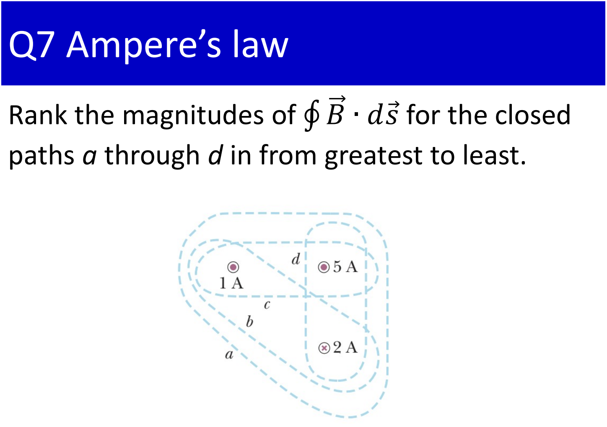

$$
c > a > d > b
$$

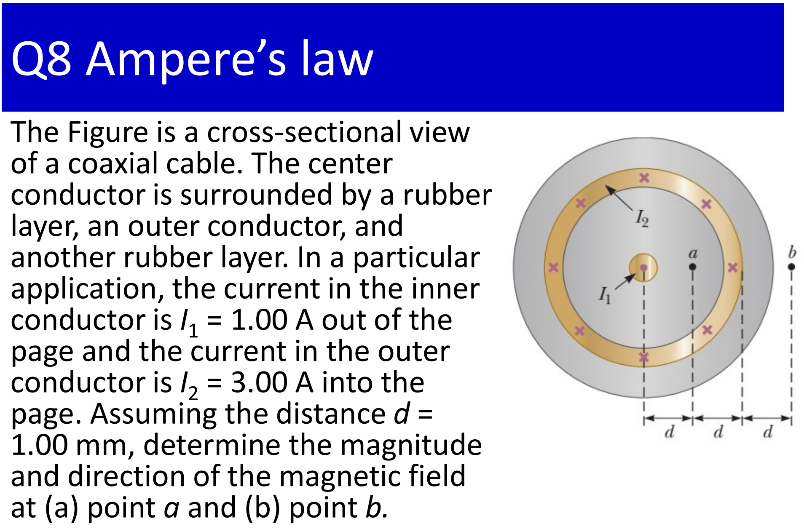
 

$a)$ The magnitude and direction of the magnetic field at point $a$ is: 

$$
B_a = \frac{\mu_0I_1}{2\pi d} = 2 \times 10^{-4} (T)
$$

The direction of $B_a$ would be upward.

$b)$ The magnitude and direction of the magnetic field at point $b$ is: 

$$
B_b = \frac{\mu_0(I_1-I_2)}{2\pi d} = -1.3 \times 10^{-4} (T)
$$

The direction of $B_b$ would be downward.

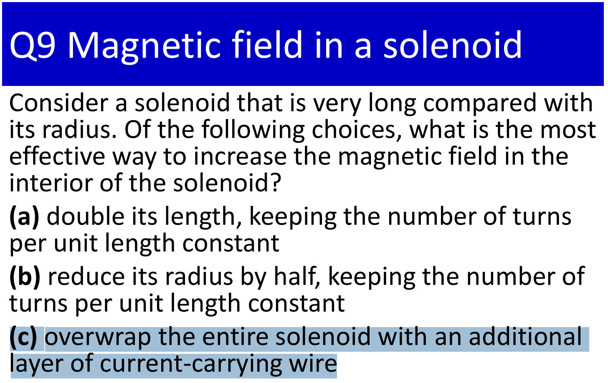

