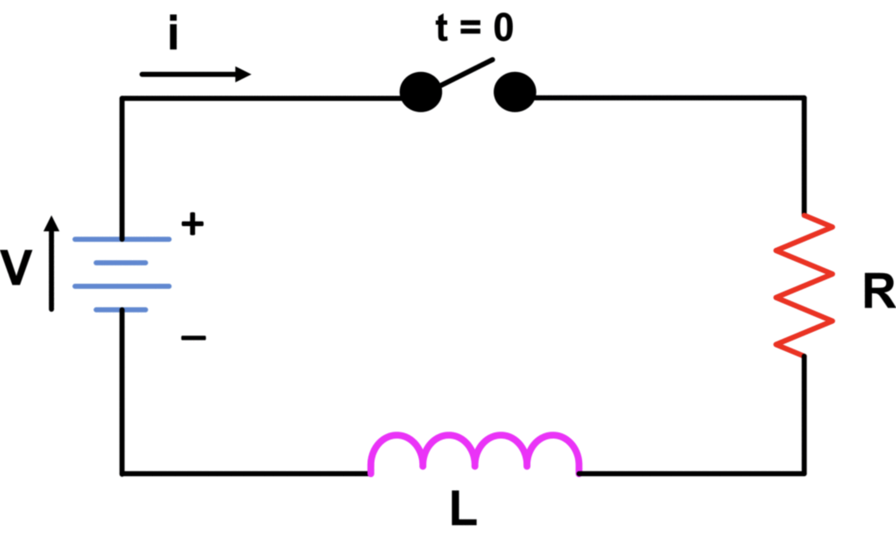
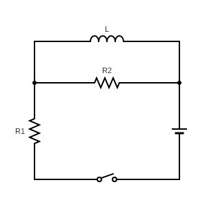



## RL Circuits
### Inductor

The inductor's inductance prevents the current in the circuit from increasing or decreasing instantaneously. The inductor causes the circuit to be "sluggish" in reacting to changes in voltage, as it opposes changes in the current.

$$
\Delta V = V_b-V_a = -L\frac {dI}{dt}
$$

### RL circuit
Kirchoff's Rule:

$$
\Delta V = -RI
$$

$$
\Delta V = -\frac QC
$$

$$
\Delta V =  V_b-V_a = -L\frac {dI}{dt}
$$

$$
\varepsilon -L\frac{dI}{dt} - RI = 0
$$

$$
-L\frac{dI}{dt} = RI -\varepsilon 
$$

$$
\int\frac{dI}{I-\frac\varepsilon R } = -\int \frac RL dt
$$

$$
\ln |I-\frac \varepsilon R|= -\frac RL t+ C
$$

$$
I - \frac\varepsilon R=Ae^{-\frac RL t}
$$

$$
I(t) = \frac \varepsilon R + Ae^{-\frac RL t}
$$

At $t = 0, \space I = 0$: 

$$
0 = \frac \varepsilon R + A \Rightarrow A = -\frac \varepsilon R
$$

Time constant of the RL circuit: $\tau = L/R$  

$$
I(t) = \frac\varepsilon R (1-e^{-t/\tau})
$$

---

Leave the switch on for a long time → treat inductor as a wire

$$
I_2 = 0 \rightarrow I_1 = \frac \varepsilon {R_1}
$$

Open the switch:

$$
-L\frac{dI}{dt} - R_2I = 0
$$

$$
\int\frac{dI}{I} = -\int \frac {R_2} Ldt 
$$

$$
\ln|I| = \frac {R_2} Lt +C 
$$

$$
I = Ae^{-\frac {R_2} Lt}
$$

Equation:

$$
I(t) = \underbrace{ \frac \varepsilon {R_1}}_{I_0}e^{-t /\tau}
$$

Power:

$$
P = R_2I^2 = R_2I^2e^{-2t /\tau} = \frac {dV}{dt}
$$

$$
V = \int dV = \int_0^ \infty R_2I^2_0e^{-2t /\tau} dt \\ = \frac \tau 2 R_2I_0^2 = \frac12LI_0^2
$$
