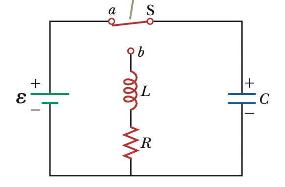
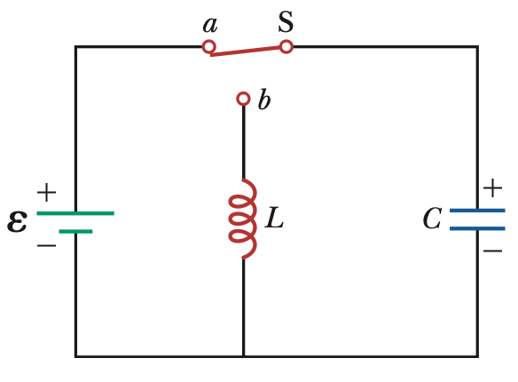
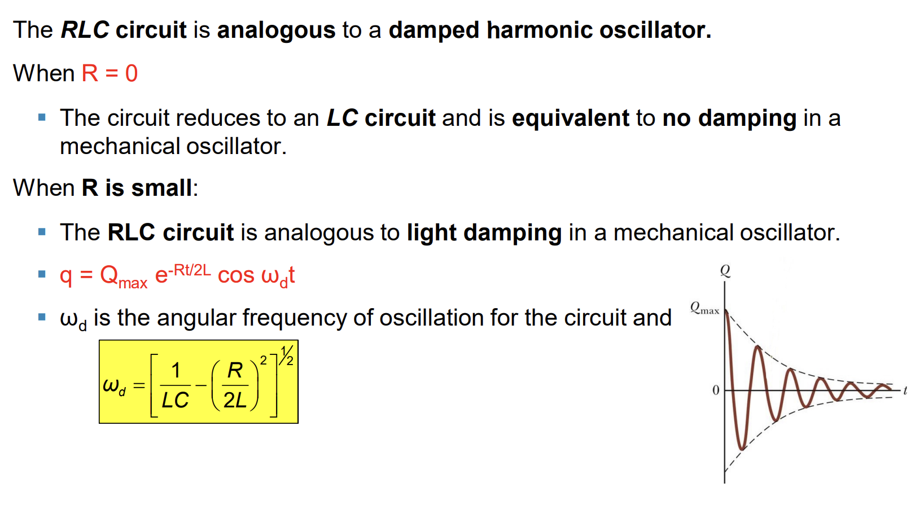
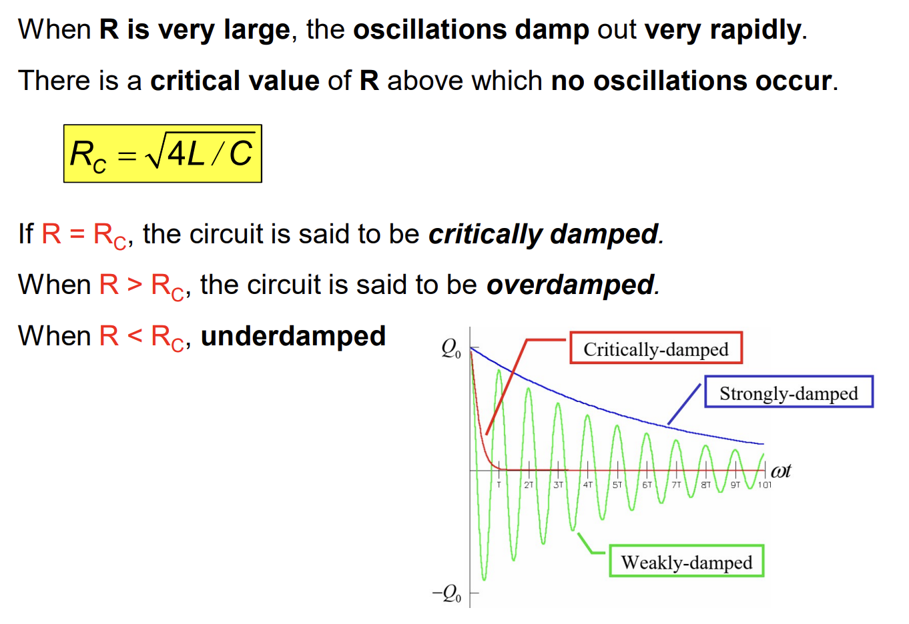
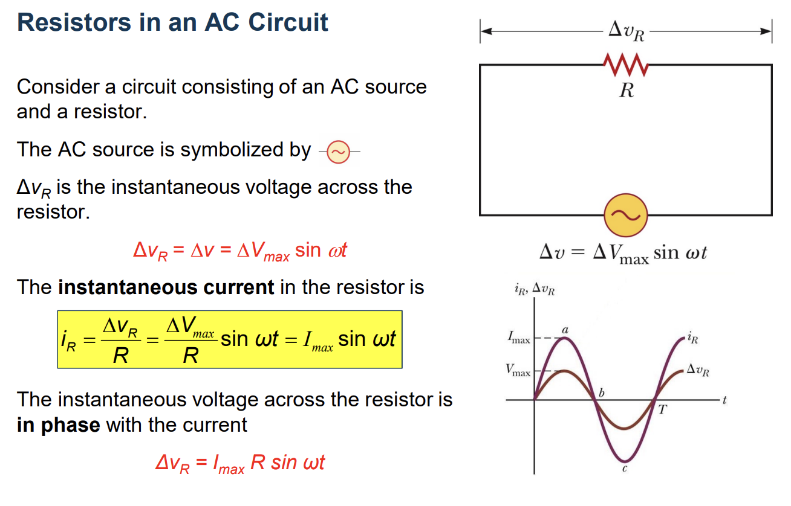
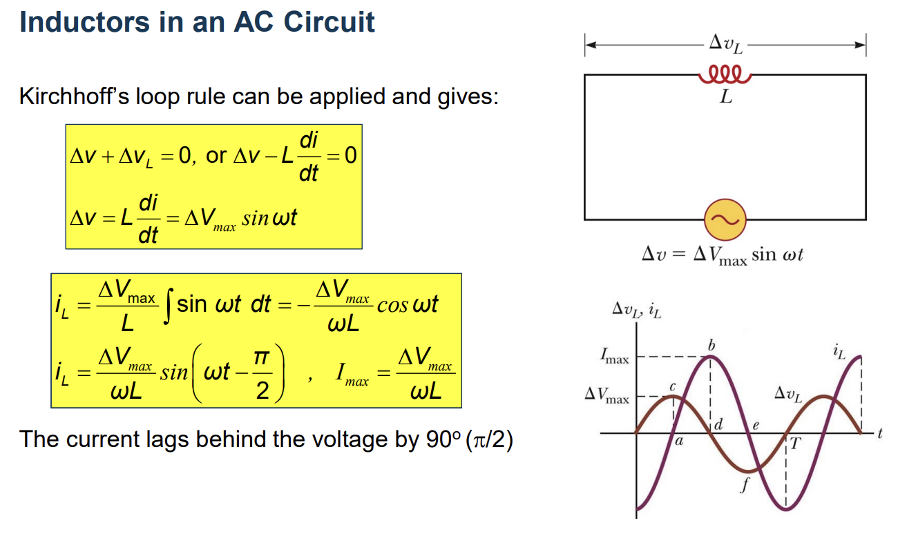
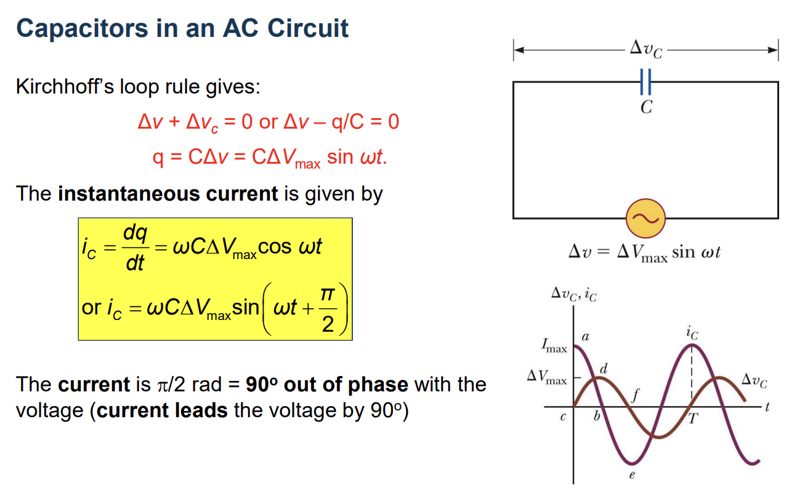
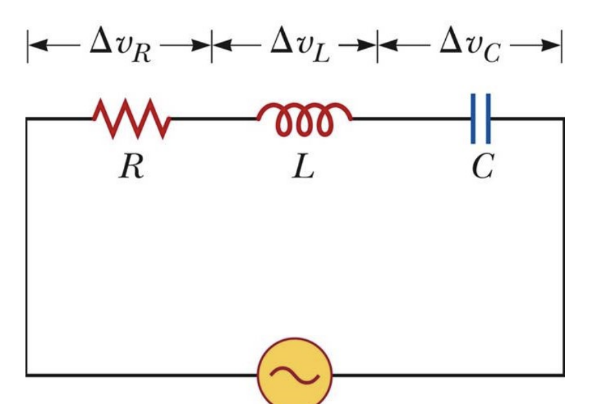



## The RLC Circuit

We have $:$

$$
\Delta U_E + \Delta U_B + \Delta E_{int} = 0
$$

Now differentiate this equation with respect to time $:$

$$
\frac{dU_E}{dt} + \frac{dU_B}{dt} + \frac{dE_{int}}{dt} = 0
$$

We have two equations $:$

$$
\Delta U_E = \frac{q^2}{2C}
$$

$$
\Delta U_B = \frac{1}{2}Li^2
$$

Recognizing that the third derivative is the rate at which energy is delivered to the resistor $:$

$$
\frac{q}{C}\frac{dq}{dt} + Li\frac{di}{dt} + i^2R = 0
$$

And $:$

$$
i = \frac{dq}{dt}
$$

So $:$

$$
L\frac{d^2q}{dt^2} + R\frac{dq}{dt} + \frac{q}{C} = 0
$$

$$
q'' + \frac{R}{L} q' + \frac{1}{LC} = 0
$$

Let $:$ $q(t) = e^{mt}$

$$
m^2 + 2\frac{R}{2L}m + \frac{1}{LC} = 0
$$

$$
\Delta' = (\frac{R}{2L})^2 - \frac{1}{LC}
$$

$\Delta > 0 :$

$$
m = -\frac{R}{2L} \pm \sqrt{(\frac{R}{2L})^2 - \frac{1}{LC}}
$$

$$
q(t) = C_1e^{m_1t} + C_2e^{m_2t}
$$

$\Delta = 0:$

$$
m = -\frac{R}{2L}
$$

$$
q(t) = e^{mt}(At+B)
$$

$\Delta < 0:$

$$
m = -\frac{R}{2L} \pm i\sqrt{(\frac{R}{2L})^2 - \frac{1}{LC}}
$$

$$
q(t) = C_1e^{m_1t} + C_2e^{m_2t}
$$

## The LC Circuit

We have : 

$$
\Delta U_E + \Delta U_B = 0
$$

Now differentiate this equation with respect to time $:$

$$
\frac{d}{dt} \bigg(\frac{q^2}{2C} + \frac{1}{2}Li^2\bigg) = \frac{q}{C}\frac{dq}{dt} + Li\frac{di}{dt}=0
$$

$$
\frac{d^2q}{dt^2} +\frac{q}{LC} = 0 \to q''(t) + \frac{1}{LC}q(t) = 0
$$

So : 

$$
q(t) = Q_0cos(\omega t + \varphi)
$$

$$
i(t) = \omega Q_0sin(\omega t + \varphi)
$$

## Damped Oscillators (Dao động tắt dần)

## AC Circuit
### Resistors in an AC Circuit

### rms Current and Voltage

$$
\Delta V_{rms} = \frac{\Delta V_{max}}{\sqrt{2}}
$$

$$
\Delta I_{rms} = \frac{\Delta I_{max}}{\sqrt{2}}
$$

### Power

$$
P = i^2R =  i_R \Delta v = \Delta V_{max}I_{max}sin^2(\omega t)
$$

$$
P_{avg} = I^2_{rms}R
$$

## Inductors in an AC Circuit

## Capacitors in an AC Circuit

## RC circuit

$$
I_{max} = \frac{\Delta V_{max, R}}{R} = \frac{\Delta V_{max, C}}{Z_C}
$$

$$
\Delta V_{max} = \sqrt{\Delta V_{max, R}^2 + \Delta V_{max, C}^2} = I_{max}\sqrt{R^2 + Z_C^2}
$$

## RLC circuit

$$
\Delta V_{max} = I_{max}\sqrt{(Z_L-Z_C)^2 + R^2}
$$

$$
I_{max} = \frac{\Delta V_{max}}{\sqrt{(Z_L-Z_C)^2 + R^2}}
$$

$$
Z_L = Z_C \to \omega^2 = \frac{1}{LC}
$$