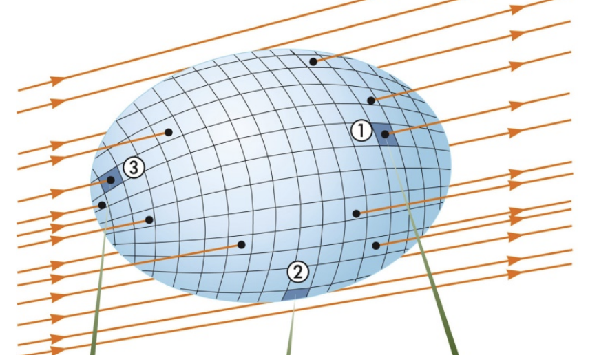
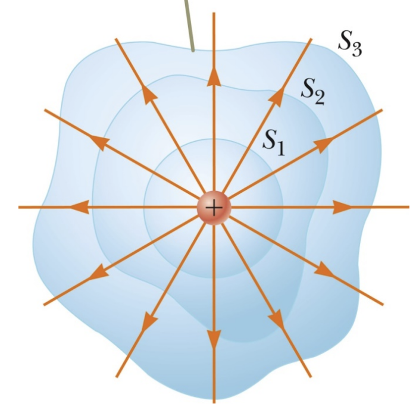
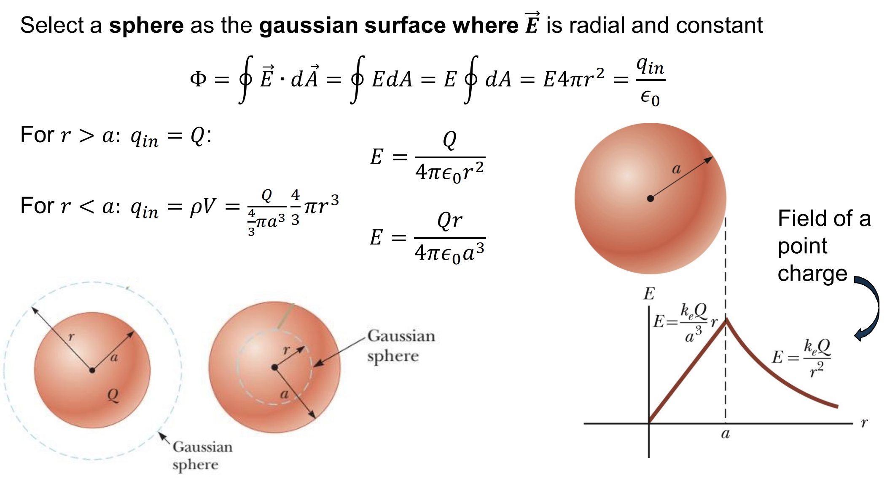



## Electric Flux (Thông Lượng Điện)
* **Electric flux** is the **product** of the **magnitude of the electric field** and the surface area, A, **perpendicular to the field.**

> **Number of field lines $\sim$ $E.dA.cos(\vec E, \vec n) = \vec E.d\vec A$**

### Open Surface

$$
\phi_E = \int_S \vec E. d\vec A
$$

$$
Units: \left[\frac{N.m^2}{C}\right]
$$

### Closed Surface
* **Net lines $\sim$ $\phi_E = \oint \vec E.d\vec A$**
* **$\phi_E > 0 \to out > into$**

### Example
  

**$\phi~total~ = 0 \to$ because electric field lines go in will go out.**

## Gauss's law
$$
\phi_E = \oint_S \vec E.d\vec A = \frac{q_{in}}{\epsilon_0}
$$

 

**The electric flux of these non symetric surfaces = the electric flux of sphere.**

## Field Due to a Spherically Symmetric Charge Distribution

## New words
* **hollow:** rỗng
* **solid:** đặc

## Other references
* [MIT Physics 2](https://www.youtube.com/playlist?list=PLyQSN7X0ro2314mKyUiOILaOC2hk6Pc3j)
* [Michel van Biezen](https://www.youtube.com/playlist?list=PLX2gX-ftPVXX7BZOcM1Y2gb8IQrTBrmUB)
* [Khan Academy](https://www.khanacademy.org/science/in-in-class-12th-physics-india)