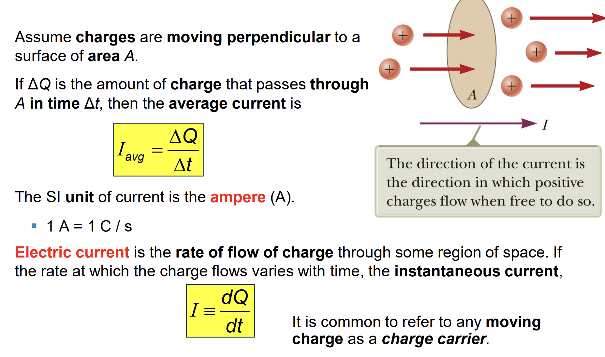
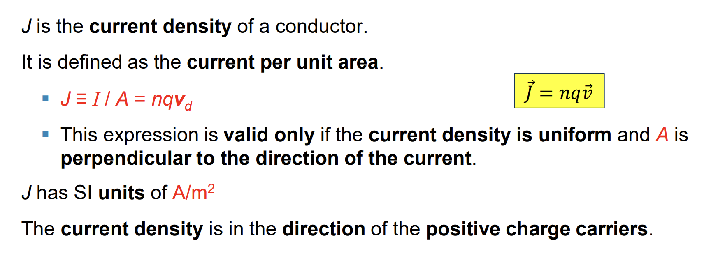
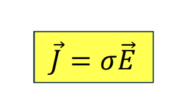
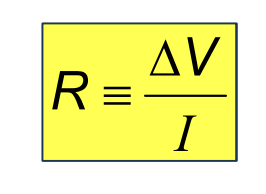
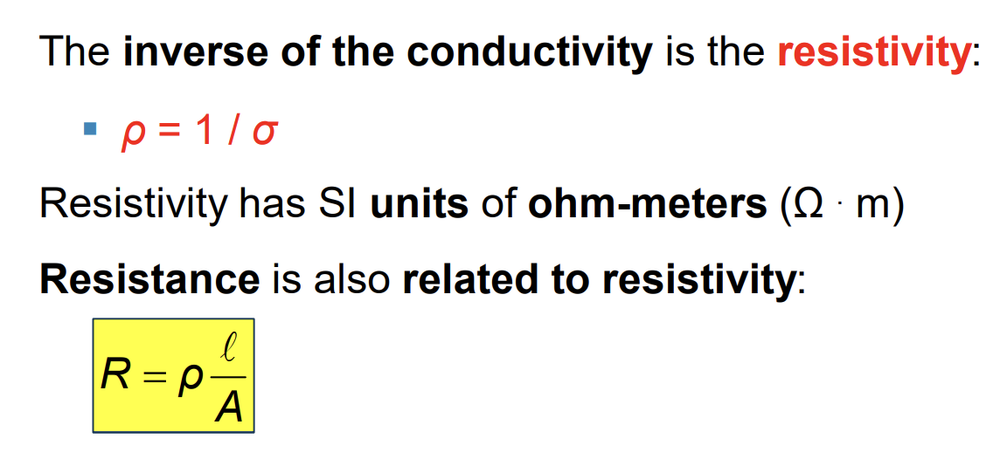
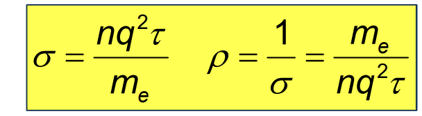
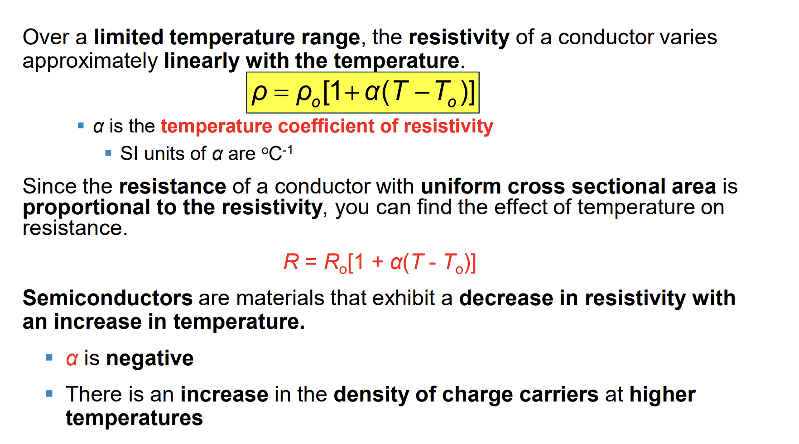
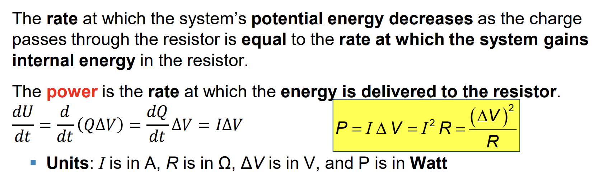



## Electric Current

## Current and Drift Speed
$\displaystyle I_{avg} = \frac{\Delta Q}{\Delta t} = \frac{n.q}{\Delta t} = \frac{\frac{n}{V}.V.q}{\Delta t} = n.A.q.v$ 
* **n is the number of mobile charge carriers per unit volume** 

## Current Density

## Ohm’s Law

$$
J = \sigma.E \to \frac{I}{A} = \sigma.\frac{\Delta V}{l} \to \frac{\Delta V}{I} = \frac{l}{\sigma.A} = R
$$

## Resistance (Điện trở)

## Resistivity (Điện trở suất)

$$
\vec a =  \frac{q.\vec E}{m_e} \to v_d = \frac{q.\vec E}{m_e}.t
$$

$$
J = n.q.v = \frac{n.q.E}{m_e}.\tau = \sigma . E 
$$

* **Note, according to this classical model, the conductivity and the resistivity do not depend on the strength of the field.**

## Resistance and Temperature

## Super Conductor (Vật liệu siêu dẫn)

## Electric Power (Joule - Lenz)

## Other references
* [MIT Physics 2](https://www.youtube.com/playlist?list=PLyQSN7X0ro2314mKyUiOILaOC2hk6Pc3j)
* [Michel van Biezen](https://www.youtube.com/playlist?list=PLX2gX-ftPVXX7BZOcM1Y2gb8IQrTBrmUB)
* [Khan Academy](https://www.khanacademy.org/science/in-in-class-12th-physics-india)