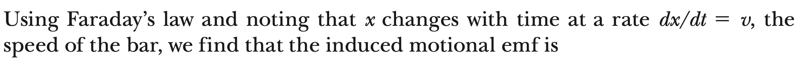



## Motional emf

$$
\displaystyle \sum F = 0 \to qE - qvb = 0 \to E = vB
$$

$$
\Delta V = El = vBl
$$

$$
I = \frac{\Delta V}{R} = \frac{El}{R} = \frac{vBl}{R}
$$

$$
F = IlB = \frac{vBl}{R}lB
$$

$$
P = Fv = \frac{(vBl)^2}{R} = \frac{(\Delta V)^2}{R} = I^2R
$$

## Faraday's Laws of Induction

## Faraday

 

$$
\displaystyle \Phi_m = Blx
$$

$$
\displaystyle \xi = -\frac{d\Phi_B}{dt} = \frac{-d}{dt}(Blx) = -Bl\frac{dx}{dt} = -Blv
$$

## Lenz’ Law

$$
\displaystyle \xi = \oint \vec E .d\vec s = -\frac{d\Phi_B}{dt} = -\frac{d}{dt}
\int\vec B.d\vec A
$$

$$
\Phi_B \uparrow \, : \vec B_{ind} \uparrow \downarrow \vec B
$$

$$
\Phi_B \downarrow \, : \vec B_{ind} \uparrow \uparrow \vec B
$$

**Remind:** $\displaystyle \oint \vec E. d\vec s$ over a closed loop is zero for conservative electric field.

## Four E&M equations

## AC Generator

$$
\displaystyle \Phi_B = BAcos\theta = BAcos(\omega t)
$$

$$
\xi = -\frac{d}{dt}(BAcos(\omega t)) = \omega BAsin(\omega t)
$$

## Eddy Currents (Foucault's currents)

$$
\displaystyle B_1 = \mu_0\frac{N}{l}I_1
$$

$$
\Phi_2 = B_1 \pi r^2 = \mu_0\frac{N}{l}I_1 \pi r^2
$$

$$
\displaystyle \xi_2 = -\frac{d\Phi_2}{dt} = -M_{12}\frac{dI_1}{dt}
$$

$$
M_{12} = \mu_0\frac{N}{l} \pi r^2\, (mutual \, inductance)
$$