

## Revision
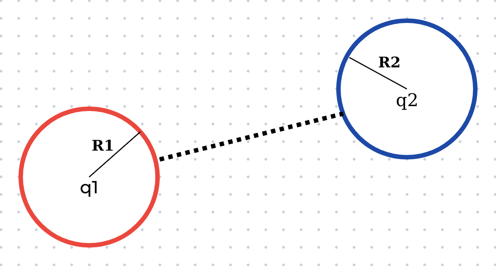

$$
V_1 = V2
$$

$$
\frac{q_1}{R_1} = \frac{q_2}{R_2}
$$

$$
\frac{\sigma_1}{\sigma_2} = \frac{q_1}{q_2}.\frac{R_2^2}{R_1^2}
$$

## Capacitance (Điện dung)
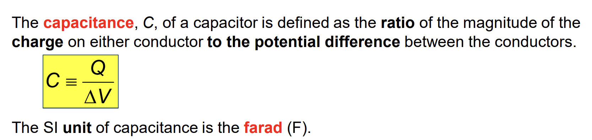
* **C doesn't depend on Q and $\Delta V$**

## Parallel Plate Capacitor(Tụ điện)
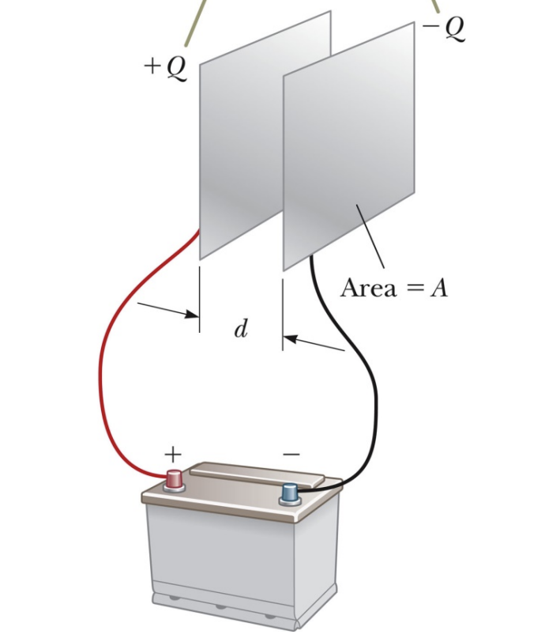

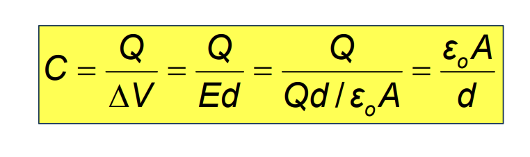

## Capacitance of a Cylindrical Capacitor
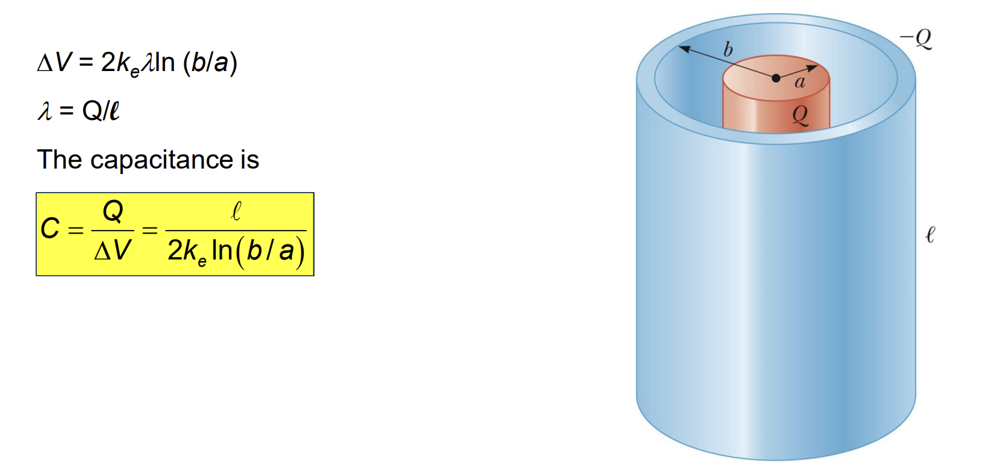

## Capacitance of a Spherical Capacitor
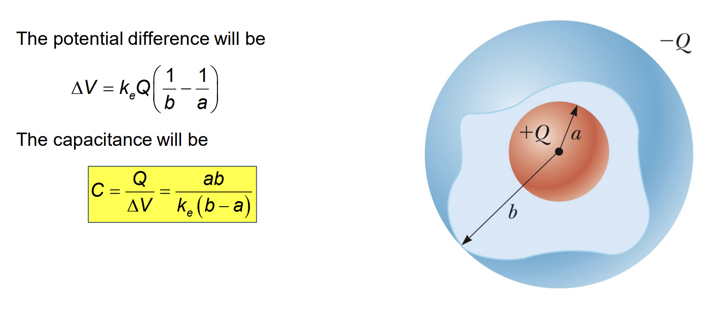

* $a \approx b: C \approx \frac{A.\epsilon_0}{d}$ 
* $b \to \infty: C \approx 4\pi\epsilon_0a$

## Capacitors in Parallel
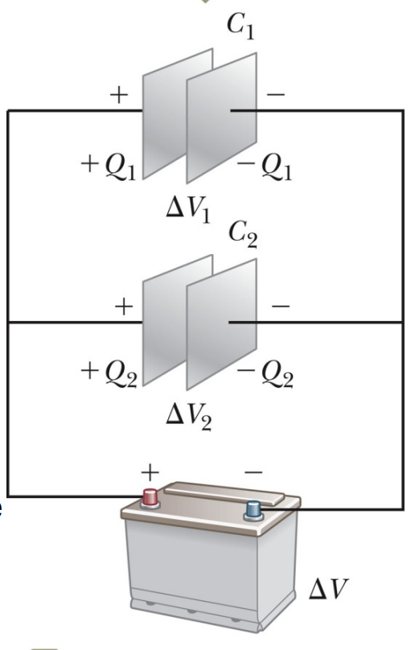

* $Q_{total} = Q_1 + Q2 = (C_1 + C_2).\Delta V$
* $C_{total} = C_1 + C_2$
* $\Delta V_1 = \Delta V_2 = \Delta V$

## Capacitors in Series
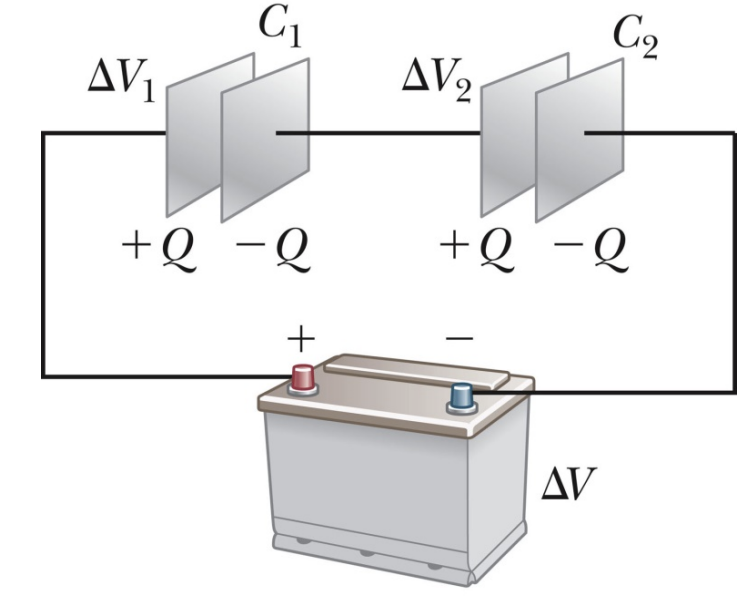

* $Q_1 = Q_2 = Q$
* $\Delta V_{total} = \Delta V_1 + \Delta V_2$
* $\frac{1}{C} = \frac{1}{C_1}+ \frac{1}{C_2}$

## Energy Stored in a Capacitor
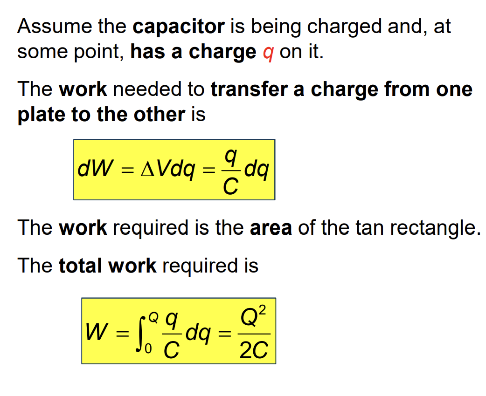

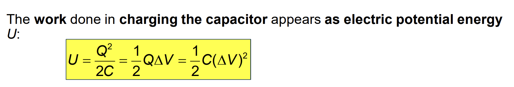

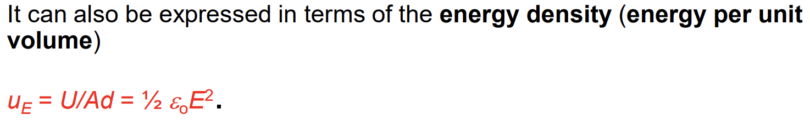

## Notes
* **Vacuum:** chân không
* $F = -\frac{dU}{dx}$

## Other references
* [MIT Physics 2](https://www.youtube.com/playlist?list=PLyQSN7X0ro2314mKyUiOILaOC2hk6Pc3j)
* [Michel van Biezen](https://www.youtube.com/playlist?list=PLX2gX-ftPVXX7BZOcM1Y2gb8IQrTBrmUB)
* [Khan Academy](https://www.khanacademy.org/science/in-in-class-12th-physics-india)